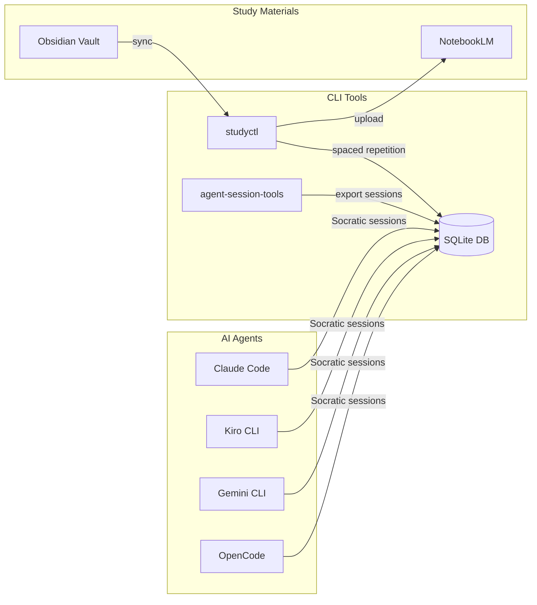

# Socratic Study Mentor

> 🧠 An AuDHD-aware study toolkit: Socratic questioning, content pipelines, spaced repetition, and AI session tracking.


## What Does It Do?

Four things:

1. **Socratic AI sessions** — Body doubling with AI mentors that ask questions instead of giving answers. Energy-adaptive (low day? shorter chunks, more scaffolding).
2. **Content pipeline** — Chunk eBooks and Obsidian notes into Google NotebookLM notebooks → generate audio overviews, quizzes, and flashcards.
3. **Flashcard review** — Spaced repetition (SM-2) via a PWA web app. Works on phone, tablet, laptop.
4. **Session tracking** — Export AI coding sessions (Claude Code, Kiro, Gemini, etc.) into a searchable SQLite database. Track trends, find struggle topics, search across sessions.

Built by a neurodivergent learner transitioning from networking to data engineering. If you're self-teaching and AuDHD, this might help.

## Quick Start

```bash
# Install
pip install studyctl agent-session-tools

# Configure
studyctl setup              # Interactive 3-question wizard
studyctl doctor             # Verify everything is healthy

# Use
studyctl content process SOURCE   # Split PDF → upload to NotebookLM
studyctl web                      # Launch flashcard/quiz PWA
session-export                    # Export AI sessions to SQLite
session-query search "decorators" # Search across all sessions
```

## Architecture



## CLI Reference

### studyctl

```bash
# Content pipeline
studyctl content split SOURCE       # Split PDF by chapters
studyctl content process SOURCE     # Split + upload to NotebookLM
studyctl content autopilot          # Generate next pending episode
studyctl content from-obsidian DIR  # Markdown → PDF → NotebookLM

# Review
studyctl review                     # Check spaced repetition due dates
studyctl struggles --days 30        # Find recurring struggle topics
studyctl web                        # Launch flashcard/quiz PWA

# Sync
studyctl sync [TOPIC] --all        # Sync notes to NotebookLM
studyctl status                     # Show sync status
studyctl topics                     # List configured topics

# Health
studyctl doctor                     # Check installation health
studyctl setup                      # Interactive configuration
```

### agent-session-tools

```bash
session-export                       # Export AI sessions to SQLite
session-query search QUERY           # Full-text search across sessions
session-query list --since 7d        # List recent sessions
session-query stats                  # Database statistics
session-sync push/pull/sync HOST     # Cross-machine sync
```

## Agent Support

| Platform | Agent | Start With |
|----------|-------|------------|
| Claude Code | `socratic-mentor` | `/agent socratic-mentor` |
| Kiro CLI | `study-mentor` | `kiro-cli chat --agent study-mentor` |
| Gemini CLI | `study-mentor` | `gemini` (auto-detected) |
| OpenCode | `study-mentor` | Tab to switch agent |

## Web PWA

Launch with `studyctl web`. Accessible from any device on the network.

- Flashcard and quiz review with SM-2 spaced repetition
- Source/chapter filter and card count limiter
- Session history with 90-day study heatmap
- Pomodoro timer with audio chime
- Voice output via Web Speech API
- OpenDyslexic font toggle
- Dark/light theme
- PWA installable — add to home screen
- Keyboard: `Space` flip, `Y`/`N` answer, `T` read aloud

## Optional Extras

```bash
pip install 'studyctl[all]'          # Everything
pip install 'studyctl[web]'          # FastAPI web UI
pip install 'studyctl[content]'      # PDF splitting + NotebookLM
pip install 'studyctl[notebooklm]'   # NotebookLM API client
```

## Documentation

- [Setup Guide](docs/setup-guide.md)
- [Agent Installation](docs/agent-install.md)
- [AuDHD Learning Philosophy](docs/audhd-learning-philosophy.md)
- [Voice Output Guide](docs/voice-output.md)
- [Contributing](CONTRIBUTING.md)

<!-- ARTEFACTS:START -->
## Generated Artefacts

> 🔍 AI-generated overviews via [Google NotebookLM](https://notebooklm.google.com)

| | |
|---|---|
| 🎧 **[Audio Overview](https://artefacts.netdevautomate.dev/socratic-study-mentor/artefacts/)** | Two AI hosts discuss the project |
| 🎬 **[Video Overview](https://artefacts.netdevautomate.dev/socratic-study-mentor/artefacts/#video)** | Visual walkthrough |
| 📊 **[Slide Deck](https://artefacts.netdevautomate.dev/socratic-study-mentor/artefacts/#slides)** | Presentation-ready overview |

*Generated by [notebooklm-repo-artefacts](https://github.com/NetDevAutomate/notebooklm-repo-artefacts)*
<!-- ARTEFACTS:END -->

## License

MIT
