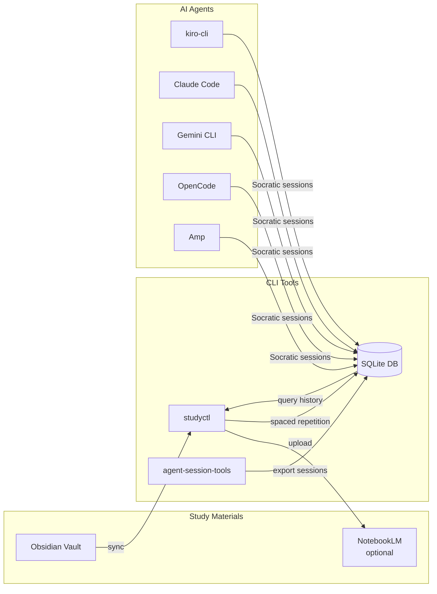

# Socratic Study Mentor

> 🧠 An AuDHD-aware Socratic study mentor with AI session management


## What is this?

An open-source study toolkit designed specifically for AuDHD learners. It combines two CLI tools with AI mentor agents that teach through Socratic questioning rather than lectures — because our brains get dopamine from *discovering* answers, not being told them. The toolkit tracks your AI study sessions across 7 tools (Claude Code, Kiro CLI, Gemini, etc.) into a searchable database, then uses that history to power spaced repetition scheduling (1/3/7/14/30 day intervals), detect topics you're repeatedly struggling with, and show you concrete evidence of progress — because RSD and imposter syndrome mean we're terrible at recognising how far we've come. It also supports body doubling sessions, energy-adaptive study modes (low energy day? shorter chunks, more scaffolding), and hyperfocus guardrails. It also supports voice output — the mentor can speak questions aloud using high-quality local TTS, adding an auditory channel that helps AuDHD learners stay focused. The agents work with both kiro-cli and Claude Code, and the whole thing syncs across machines. If you're neurodivergent and self-teaching (especially career transitions), this might help — it's built by someone in exactly that position.

## Who is this for?

- **AuDHD learners** who need structured, dopamine-friendly study approaches
- **Self-taught developers** who benefit from Socratic questioning over passive reading
- **Anyone** who wants to track AI study sessions and build spaced repetition into their learning

## Architecture



## Features

**studyctl** — Study pipeline management
- Sync Obsidian notes to Google NotebookLM notebooks
- Spaced repetition scheduling (1/3/7/14/30 day intervals)
- Struggle topic detection from session history
- Win tracking — see concepts you've mastered, fight imposter syndrome
- Calendar time-blocking — generate `.ics` study blocks from your review schedule
- Progress recording with confidence levels (struggling → learning → confident → mastered)
- Concept graph — track how concepts relate (prerequisites, analogies, confusion risks)
- Prerequisite chain traversal — find the root cause when you're stuck
- Cross-machine state sync via SSH
- Scheduled auto-sync (launchd on macOS, cron on Linux)

**agent-session-tools** — AI session management
- 7 source exporters: Claude Code, Kiro CLI, Gemini CLI, Aider, OpenCode, LiteLLM, RepoPrompt
- FTS5 full-text search across all sessions
- Hybrid semantic search (FTS + vector embeddings)
- Session classification and deduplication
- Study progress and energy tracking database
- Cross-machine database sync via SSH

**AI Agents** — Socratic mentoring
- AuDHD-aware teaching methodology (questions > lectures)
- Energy-adaptive sessions (low/medium/high adjusts difficulty and chunk size)
- Emotional regulation check (calm/anxious/frustrated/flat/shutdown)
- Transition support with grounding rituals
- Parking lot for tangential thoughts
- Sensory environment adaptation
- Micro-celebrations for dopamine maintenance
- Interleaved review sessions
- End-of-session protocol: auto-record progress, suggest next review, offer calendar blocks
- Break reminders at 25/50/90 minute intervals
- Claude Code status line showing energy level, session timer, and context usage
- Network→Data Engineering concept bridges
- Body doubling session support
- Progress tracking across agents and machines
- Voice output via study-speak (kokoro-onnx TTS, am_michael voice)
- @speak-start/@speak-stop toggle for voice control
- Configurable voice, speed, and backend

**MCP Integrations** — Optional calendar and reminder support
- Apple Calendar + Reminders (macOS) — native notifications for study time
- Google Calendar (cross-platform) — time-blocking via built-in connector or MCP server
- See [agents/mcp/README.md](agents/mcp/README.md) for setup

## Quick Start

```bash
git clone https://github.com/NetDevAutomate/Socratic-Study-Mentor.git
cd Socratic-Study-Mentor
./scripts/install.sh

# Or install all CLI tools globally (studyctl, session-export, etc.)
./scripts/install-tools.sh
```

This installs both packages, sets up agent definitions for any detected AI tools, and optionally downloads the voice model for TTS support. The `install-tools.sh` script registers all workspace packages as global `uv` tools so they're available without activating a venv.

Then run the interactive setup wizard:

```bash
studyctl config init
```

This asks three core questions: whether to enable knowledge bridging (leveraging topics you already know), NotebookLM integration, and Obsidian vault path.

## Documentation Site

Browse the full docs locally with AuDHD-friendly design (OpenDyslexic font toggle, Nord colour scheme, reading preferences):

```bash
uv pip install 'socratic-study-mentor[docs]'
mkdocs serve
# Open http://localhost:8000
```

## Agent Support

| Platform | Agent | Description |
|----------|-------|-------------|
| kiro-cli | `study-mentor` | Full study session management with spaced repetition and NotebookLM |
| Claude Code | `socratic-mentor` | Socratic questioning with AuDHD-aware pedagogy |
| Claude Code | `mentor-reviewer` | Autonomous code review with scoring and tutorial generation |
| Gemini CLI | `study-mentor` | Socratic study sessions with energy-adaptive teaching |
| OpenCode | `study-mentor` | AuDHD-aware study mentor with spaced repetition |
| Amp | (via AGENTS.md) | Socratic mentoring loaded automatically from project context |

Start a session:

```bash
# kiro-cli
kiro-cli chat --agent study-mentor

# Claude Code
/agent socratic-mentor

# Gemini CLI (subagent auto-detected)
gemini  # then ask for study session

# OpenCode
opencode  # Tab to switch to study-mentor

# Amp
amp  # AGENTS.md loaded automatically
```

See [docs/agent-install.md](docs/agent-install.md) for setup details.

## Optional Dependencies

| Feature | Package | Install |
|---------|---------|---------|
| NotebookLM sync | `notebooklm-py` | `uv pip install studyctl[notebooklm]` |
| Semantic search | `sentence-transformers` | `uv pip install agent-session-tools[semantic]` |
| Token counting | `tiktoken` | `uv pip install agent-session-tools[tokens]` |
| TUI interface | `textual` | `uv pip install agent-session-tools[tui]` |
| TTS voice output | `kokoro-onnx` | `uv tool install "./packages/agent-session-tools[tts]"` |

## CLI Reference

### studyctl

```bash
studyctl sync [TOPIC] --all --dry-run   # Sync notes to NotebookLM
studyctl status [TOPIC]                  # Show sync status
studyctl review                          # Check spaced repetition due dates
studyctl struggles --days 30             # Find recurring struggle topics
studyctl wins --days 30                  # Show your learning wins
studyctl progress CONCEPT -t TOPIC -c LEVEL  # Record progress on a concept
studyctl schedule-blocks --start 14:00   # Generate .ics calendar study blocks
studyctl topics                          # List configured topics
studyctl audio TOPIC                     # Generate NotebookLM audio overview
studyctl dedup [TOPIC] --all --dry-run   # Remove duplicate notebook sources
studyctl config init                     # Interactive setup wizard
studyctl config show                     # Display current configuration
studyctl concepts list [-d DOMAIN]       # List concepts in the graph
studyctl concepts add NAME -d DOMAIN    # Add a concept
studyctl concepts relate SRC TGT --type TYPE -d DOMAIN  # Add a relation
studyctl prereqs CONCEPT -d DOMAIN      # Show prerequisite chain (recursive)
studyctl related CONCEPT -d DOMAIN      # Show concept neighbourhood
studyctl state push|pull|status|init     # Cross-machine state sync
studyctl schedule install|remove|list    # Manage scheduled jobs
```

### agent-session-tools

```bash
session-export [--source SOURCE]         # Export AI sessions to SQLite
session-query search QUERY               # Full-text search across sessions
session-query list --since 7d            # List recent sessions
session-query show SESSION_ID            # Show session details
session-query context SESSION_ID         # Generate context for resuming
session-query stats                      # Database statistics
session-sync push|pull REMOTE            # Sync database across machines
session-maint vacuum|reindex|schema      # Database maintenance
tutor-checkpoint code --skill SKILL      # Record study progress
study-speak TEXT                         # Speak text aloud using TTS
study-speak - < file.txt                 # Speak from stdin
study-speak TEXT -v af_heart -s 1.2      # Custom voice and speed
```

## Documentation

- [Setup Guide](docs/setup-guide.md) — Installation, configuration, Obsidian setup
- [Agent Installation](docs/agent-install.md) — AI agent setup for kiro-cli, Claude Code, Gemini CLI, OpenCode, and Amp
- [AuDHD Learning Philosophy](docs/audhd-learning-philosophy.md) — Why this exists and how it works
- [MCP Integrations](agents/mcp/README.md) — Calendar, reminders, and other MCP server configs
- [Voice Output Guide](docs/voice-output.md) — TTS setup, configuration, and agent integration
- [Concept Graph](docs/concept-graph.md) — How the concept graph connects your study data
- [Roadmap](docs/roadmap.md) — What's coming in v1.1 and beyond
- [Contributing](CONTRIBUTING.md) — Development setup and contribution guide

## Contributing

See [CONTRIBUTING.md](CONTRIBUTING.md) for development setup, code style, and how to add new exporters or study topics.

## Acknowledgements

> **Special thanks to [Teng Lin](https://github.com/teng-lin)** for creating the excellent [notebooklm-py](https://github.com/teng-lin/notebooklm-py) library, which powers all NotebookLM integration across the study mentor ecosystem. His work in reverse-engineering and wrapping the NotebookLM API made the audio/video overview generation in [notebooklm-pdf-by-chapters](https://github.com/andytaylor/notebooklm-pdf-by-chapters) and [notebooklm-repo-artefacts](https://github.com/andytaylor/notebooklm-repo-artefacts) possible.

<!-- ARTEFACTS:START -->
## Generated Artefacts

> 🔍 **Explore this project** — AI-generated overviews via [Google NotebookLM](https://notebooklm.google.com)

| | |
|---|---|
| 🎧 **[Listen to the Audio Overview](https://artefacts.netdevautomate.dev/Socratic-Study-Mentor/artefacts/)** | Two AI hosts discuss the project — great for commutes |
| 🎬 **[Watch the Video Overview](https://artefacts.netdevautomate.dev/Socratic-Study-Mentor/artefacts/#video)** | Visual walkthrough of architecture and concepts |
| 🖼️ **[View the Infographic](https://artefacts.netdevautomate.dev/Socratic-Study-Mentor/artefacts/#infographic)** | Architecture and flow at a glance |
| 📊 **[Browse the Slide Deck](https://artefacts.netdevautomate.dev/Socratic-Study-Mentor/artefacts/#slides)** | Presentation-ready project overview |

*Generated by [notebooklm-repo-artefacts](https://github.com/NetDevAutomate/notebooklm-repo-artefacts)*
<!-- ARTEFACTS:END -->

## License

MIT
