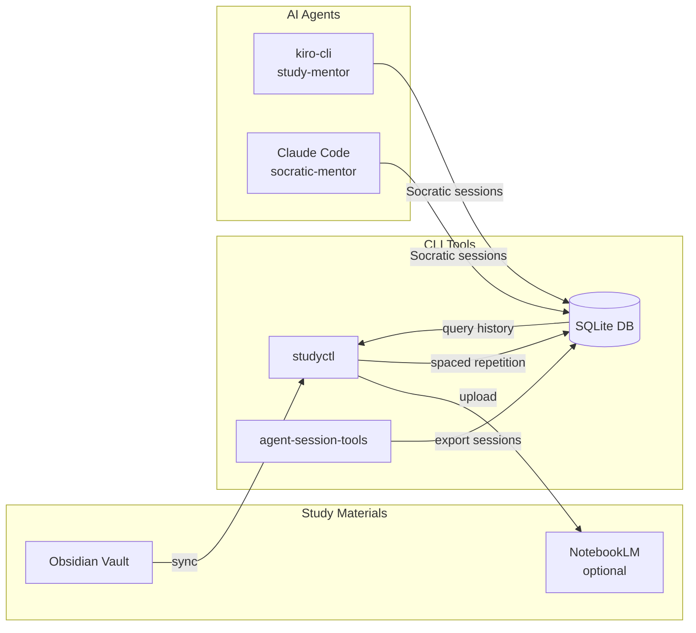

# Socratic Study Mentor

> 🧠 An AuDHD-aware Socratic study mentor with AI session management


## What is this?

A study toolkit built for neurodivergent learners (AuDHD) that combines CLI tools for managing study materials with AI mentor agents that teach through Socratic questioning. It connects your Obsidian notes, AI conversation history, and spaced repetition into one workflow.

## Who is this for?

- **AuDHD learners** who need structured, dopamine-friendly study approaches
- **Self-taught developers** who benefit from Socratic questioning over passive reading
- **Anyone** who wants to track AI study sessions and build spaced repetition into their learning

## Architecture



## Features

**studyctl** — Study pipeline management
- Sync Obsidian notes to Google NotebookLM notebooks
- Spaced repetition scheduling (1/3/7/14/30 day intervals)
- Struggle topic detection from session history
- Cross-machine state sync via SSH
- Scheduled auto-sync (launchd on macOS, cron on Linux)

**agent-session-tools** — AI session management
- 8 source exporters: Claude Code, Kiro CLI, Gemini CLI, Aider, OpenCode, LiteLLM, RepoPrompt, Bedrock
- FTS5 full-text search across all sessions
- Hybrid semantic search (FTS + vector embeddings)
- Session classification and deduplication
- Cross-machine database sync via SSH

**AI Agents** — Socratic mentoring
- AuDHD-aware teaching methodology (questions > lectures)
- Network→Data Engineering concept bridges
- Body doubling session support
- Progress tracking across agents and machines

## Quick Start

```bash
git clone https://github.com/andytaylor/socratic-study-mentor.git
cd socratic-study-mentor
./scripts/install.sh
```

This installs both packages and sets up agent definitions for any detected AI tools.

## Agent Support

| Platform | Agent | Description |
|----------|-------|-------------|
| kiro-cli | `study-mentor` | Full study session management with spaced repetition and NotebookLM |
| Claude Code | `socratic-mentor` | Socratic questioning with Clean Code/GoF pedagogy |
| Claude Code | `mentor-reviewer` | Autonomous code review with scoring and tutorial generation |

Start a session:

```bash
# kiro-cli
kiro-cli chat --agent study-mentor

# Claude Code
/agent socratic-mentor
```

See [docs/agent-install.md](docs/agent-install.md) for setup details.

## Optional Dependencies

| Feature | Package | Install |
|---------|---------|---------|
| NotebookLM sync | `notebooklm-py` | `uv pip install studyctl[notebooklm]` |
| Semantic search | `sentence-transformers` | `uv pip install agent-session-tools[semantic]` |
| Token counting | `tiktoken` | `uv pip install agent-session-tools[tokens]` |
| TUI interface | `textual` | `uv pip install agent-session-tools[tui]` |

## CLI Reference

### studyctl

```bash
studyctl sync [TOPIC] --all --dry-run   # Sync notes to NotebookLM
studyctl status [TOPIC]                  # Show sync status
studyctl review                          # Check spaced repetition due dates
studyctl struggles --days 30             # Find recurring struggle topics
studyctl topics                          # List configured topics
studyctl audio TOPIC                     # Generate NotebookLM audio overview
studyctl dedup [TOPIC] --all --dry-run   # Remove duplicate notebook sources
studyctl state push|pull|status|init     # Cross-machine state sync
studyctl schedule install|remove|list    # Manage scheduled jobs
```

### agent-session-tools

```bash
session-export [--source SOURCE]         # Export AI sessions to SQLite
session-query search QUERY               # Full-text search across sessions
session-query list --since 7d            # List recent sessions
session-query show SESSION_ID            # Show session details
session-query context SESSION_ID         # Generate context for resuming
session-query stats                      # Database statistics
session-sync push|pull REMOTE            # Sync database across machines
session-maint vacuum|reindex|schema      # Database maintenance
tutor-checkpoint code --skill SKILL      # Record study progress
```

## Documentation

- [Setup Guide](docs/setup-guide.md) — Installation, configuration, Obsidian setup
- [Agent Installation](docs/agent-install.md) — AI agent setup for kiro-cli and Claude Code
- [AuDHD Learning Philosophy](docs/audhd-learning-philosophy.md) — Why this exists and how it works
- [Contributing](CONTRIBUTING.md) — Development setup and contribution guide

## Contributing

See [CONTRIBUTING.md](CONTRIBUTING.md) for development setup, code style, and how to add new exporters or study topics.

## License

MIT
