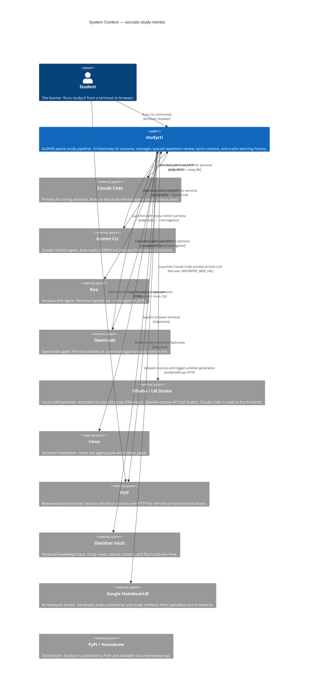
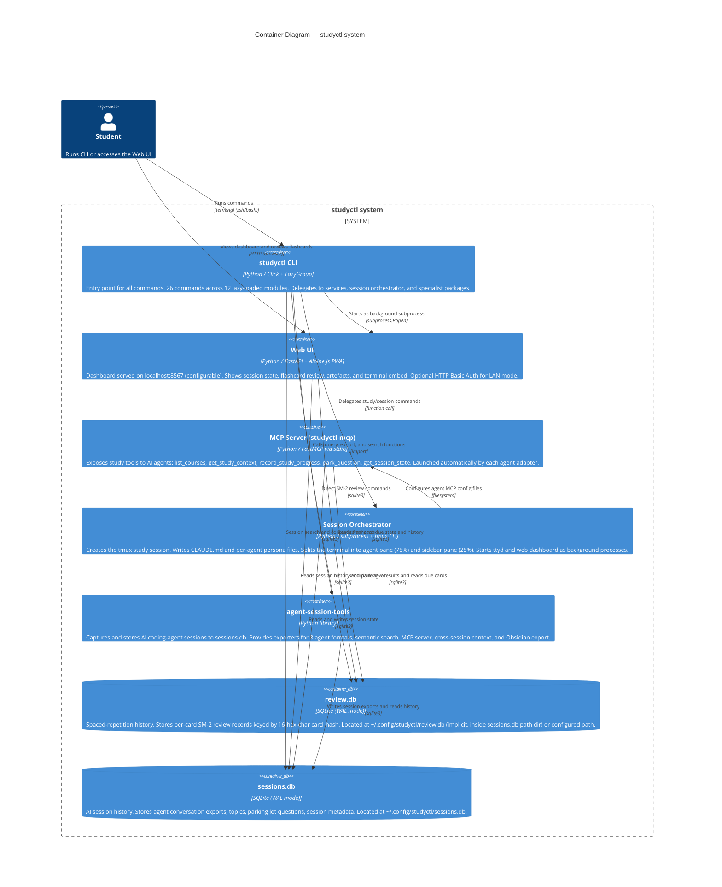
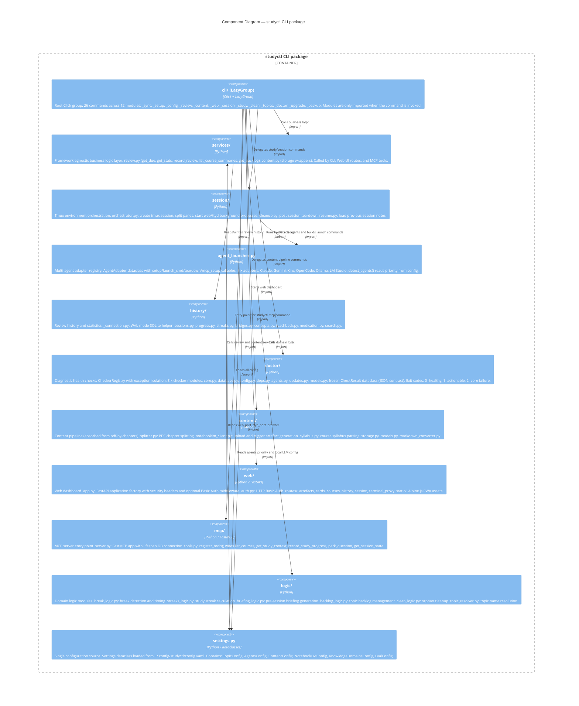
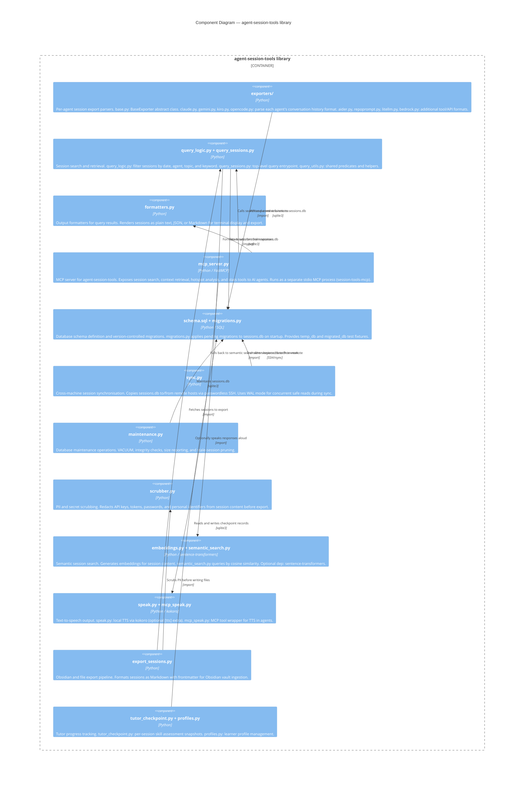

# C4 Architecture Diagrams

This document describes the architecture of the socratic-study-mentor system at three levels of abstraction, following the C4 model (Context, Container, Component).

---

## Level 1 — System Context

The System Context diagram shows studyctl and the external actors it interacts with. The student is the primary user; AI coding agents are the learning partners that the system orchestrates. External services provide content, storage, and infrastructure.

---

## Level 2 — Container

The Container diagram zooms into studyctl itself, showing the distinct deployable units and libraries, and how data flows between them. All containers run on the student's local machine.

---

## Level 3a — Components: studyctl CLI

This diagram shows the internal component structure of the studyctl CLI package. The CLI layer is deliberately thin — it delegates immediately to services, logic, or specialist packages.

---

## Level 3b — Components: agent-session-tools

This diagram shows the internal structure of the `agent-session-tools` library, which is the cross-agent session capture and retrieval layer shared across all AI coding agents.

