# Study Backlog Phase 1 — Software Architecture

*Source of truth for implementation and test design.*

## 1. System Overview

The Study Backlog is a **query layer** over the existing `parked_topics` table — no new tables. It surfaces pending topics across sessions via CLI commands, auto-persists struggled topics at session end, and injects backlog context into the agent at session start.

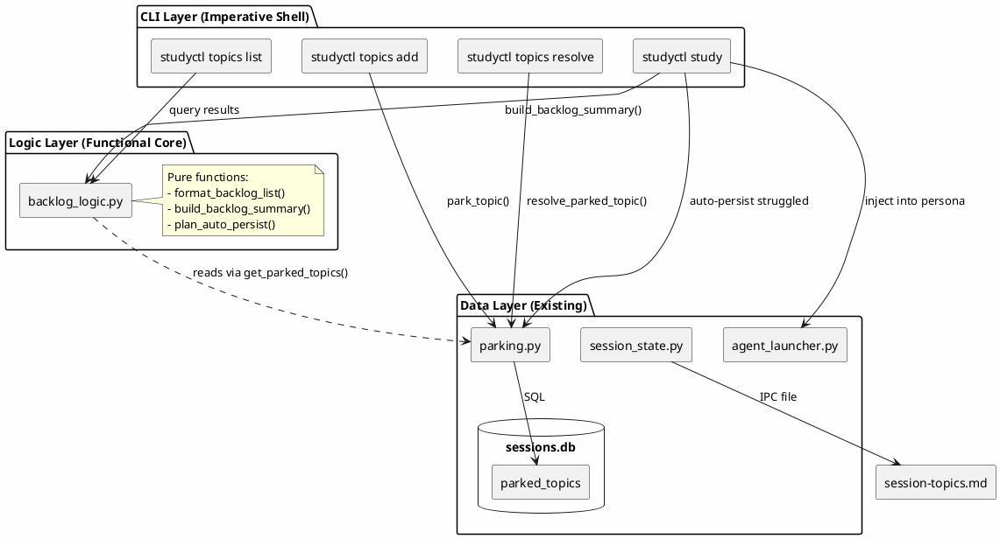

## 2. Data Model

### 2.1 Current Schema (v15)

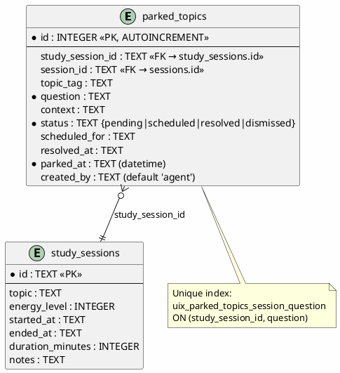

### 2.2 Migration v16 Changes

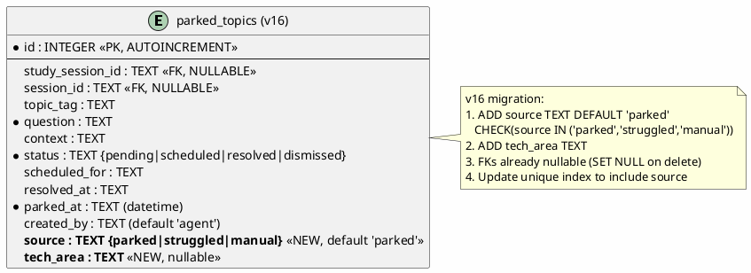

**Migration v16 SQL:**

```sql
-- Add source column to distinguish parked/struggled/manual entries
ALTER TABLE parked_topics
    ADD COLUMN source TEXT NOT NULL DEFAULT 'parked'
    CHECK(source IN ('parked', 'struggled', 'manual'));

-- Add tech_area for technology categorization
ALTER TABLE parked_topics
    ADD COLUMN tech_area TEXT;

-- Update unique index to allow same question from different sources
DROP INDEX IF EXISTS uix_parked_topics_session_question;
CREATE UNIQUE INDEX uix_parked_topics_session_question
    ON parked_topics (study_session_id, question, source);
```

## 3. Command Flows

### 3.1 `studyctl topics list`

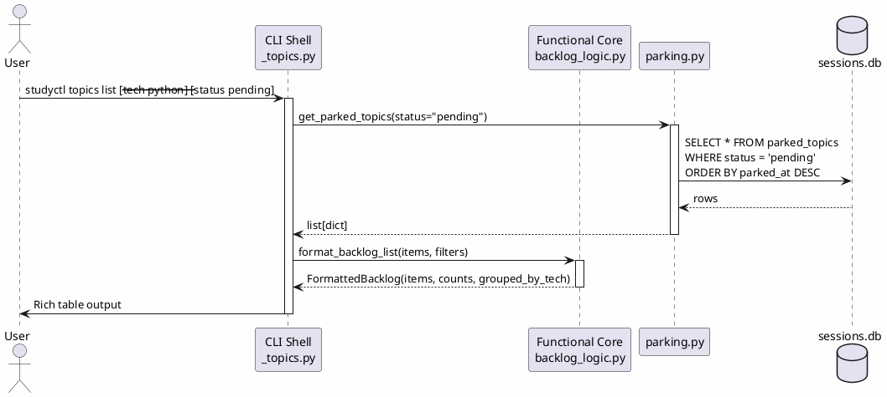

### 3.2 `studyctl topics add`

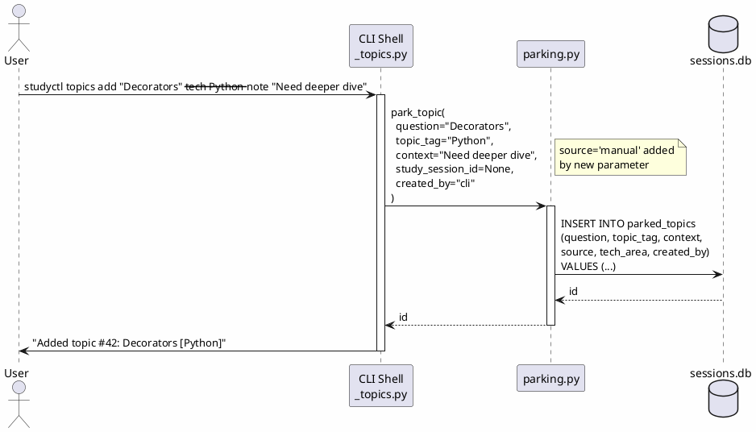

### 3.3 `studyctl topics resolve`

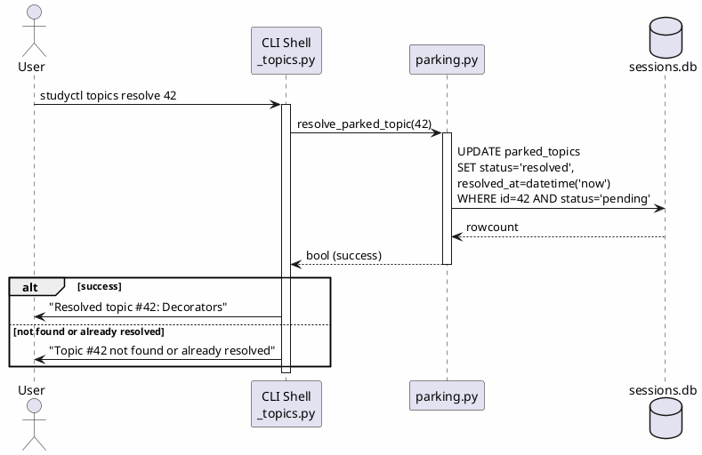

### 3.4 Auto-persist Struggled Topics (Session End)

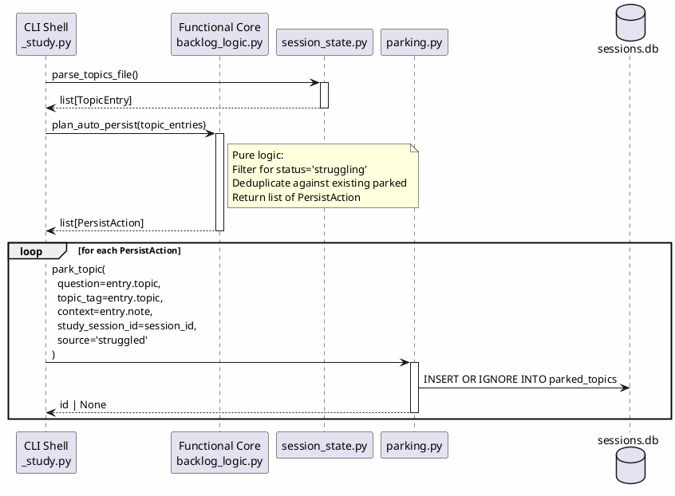

### 3.5 Agent Backlog Surfacing (Session Start)

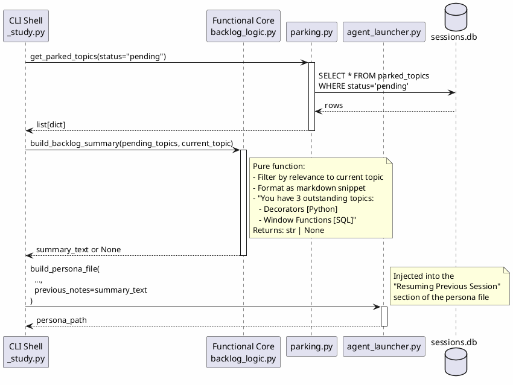

## 4. Module Structure

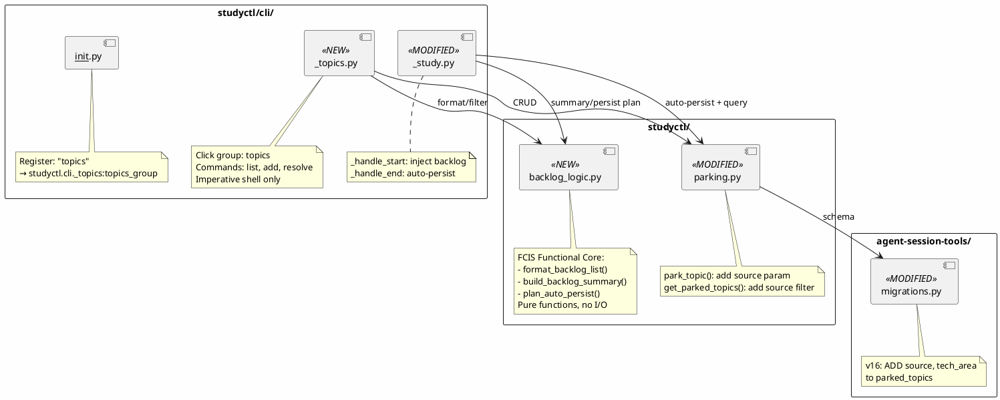

## 5. FCIS Architecture — `backlog_logic.py`

Following the Functional Core, Imperative Shell pattern established in `_clean_logic.py`:

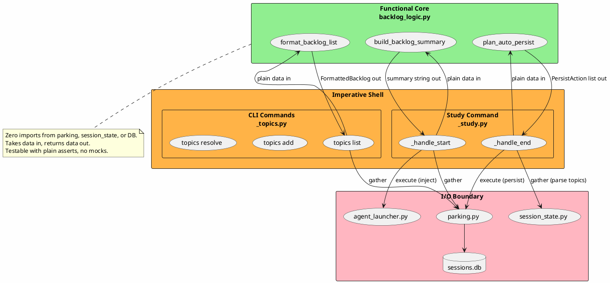

### Core Data Types

```python
@dataclass
class BacklogItem:
    """A single backlog entry — pre-fetched from DB."""
    id: int
    question: str
    topic_tag: str | None
    tech_area: str | None
    source: str          # parked | struggled | manual
    context: str | None
    parked_at: str
    session_topic: str | None  # from study_sessions.topic via join


@dataclass
class FormattedBacklog:
    """Result of format_backlog_list() — ready for display."""
    items: list[BacklogItem]
    total: int
    by_tech: dict[str, list[BacklogItem]]  # grouped by tech_area
    by_source: dict[str, int]              # count per source


@dataclass
class PersistAction:
    """A struggled topic to persist to parked_topics."""
    question: str
    topic_tag: str | None
    context: str | None
    study_session_id: str
    source: str  # 'struggled'
```

### Core Functions

```python
def format_backlog_list(
    items: list[BacklogItem],
    *,
    tech_filter: str | None = None,
    source_filter: str | None = None,
) -> FormattedBacklog:
    """Filter and group backlog items for display. Pure logic."""


def build_backlog_summary(
    pending_items: list[BacklogItem],
    current_topic: str,
) -> str | None:
    """Build markdown snippet for agent persona injection.

    Returns None if no pending items. Prioritises items
    matching current_topic's tech area.
    """


def plan_auto_persist(
    topic_entries: list[TopicEntry],
    existing_questions: set[str],
    study_session_id: str,
) -> list[PersistAction]:
    """Decide which struggled topics to persist.

    Filters for status='struggling', deduplicates against
    existing_questions (already in parked_topics for this session).
    """
```

## 6. Test Architecture

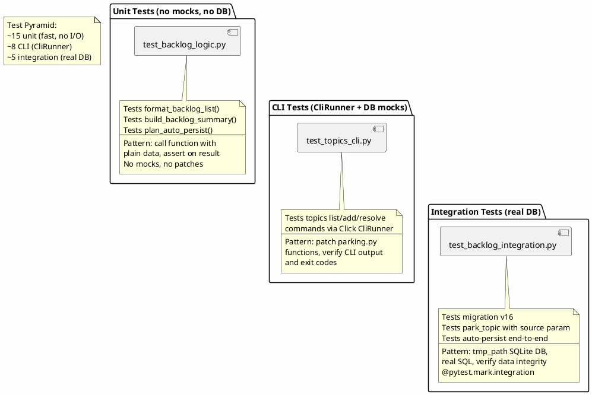

### Test Matrix

| Test File | Layer | What It Tests | Mocks? | DB? |
|-----------|-------|---------------|--------|-----|
| `test_backlog_logic.py` | Unit | `format_backlog_list()`, `build_backlog_summary()`, `plan_auto_persist()` | None | No |
| `test_topics_cli.py` | CLI | `topics list`, `topics add`, `topics resolve` commands | parking.py functions | No |
| `test_backlog_integration.py` | Integration | Migration v16, park_topic with source, auto-persist flow | None | Yes (tmp) |

### Key Test Cases

**Unit (backlog_logic.py):**
- Empty backlog → `FormattedBacklog` with zero items
- Filter by tech_area → only matching items
- Filter by source → only matching items
- Group by tech → correct bucketing
- `build_backlog_summary` with no items → None
- `build_backlog_summary` prioritises current topic's tech
- `plan_auto_persist` filters only struggling status
- `plan_auto_persist` deduplicates against existing
- `plan_auto_persist` with no struggled → empty list

**CLI (topics commands):**
- `topics list` with no items → "No pending topics"
- `topics list` with items → table output
- `topics list --tech Python` → filtered output
- `topics add` → success message with ID
- `topics resolve 42` → success message
- `topics resolve 999` → "not found" error

**Integration (real DB):**
- Migration v16 runs cleanly on v15 schema
- `park_topic(source='manual')` with NULL session refs
- `park_topic(source='struggled')` with session ref
- `get_parked_topics()` returns source and tech_area
- Unique index allows same question from different sources
- Auto-persist end-to-end: parse topics → plan → persist → query

## 7. File Inventory

| File | Action | Description |
|------|--------|-------------|
| `agent-session-tools/.../migrations.py` | Modify | Add migration v16 (source, tech_area columns) |
| `studyctl/backlog_logic.py` | **Create** | FCIS functional core — pure logic |
| `studyctl/parking.py` | Modify | Add `source` param to `park_topic()`, `tech_area` param |
| `studyctl/cli/_topics.py` | **Create** | Click group with list/add/resolve commands |
| `studyctl/cli/__init__.py` | Modify | Register `topics` lazy command |
| `studyctl/cli/_study.py` | Modify | Inject backlog in `_handle_start`, auto-persist in `_handle_end` |
| `tests/test_backlog_logic.py` | **Create** | Unit tests for pure logic |
| `tests/test_topics_cli.py` | **Create** | CLI tests for topics commands |
| `tests/test_backlog_integration.py` | **Create** | Integration tests (marked, not CI) |

## 8. Implementation Order

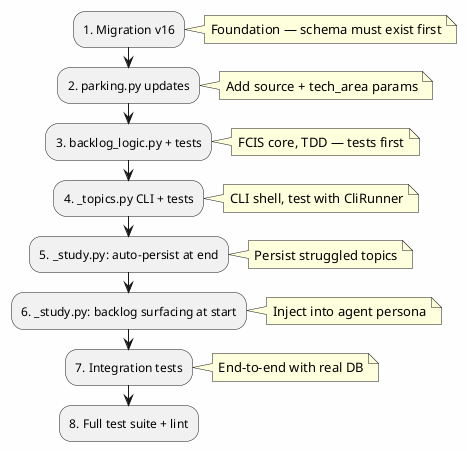

Each phase is independently committable.
