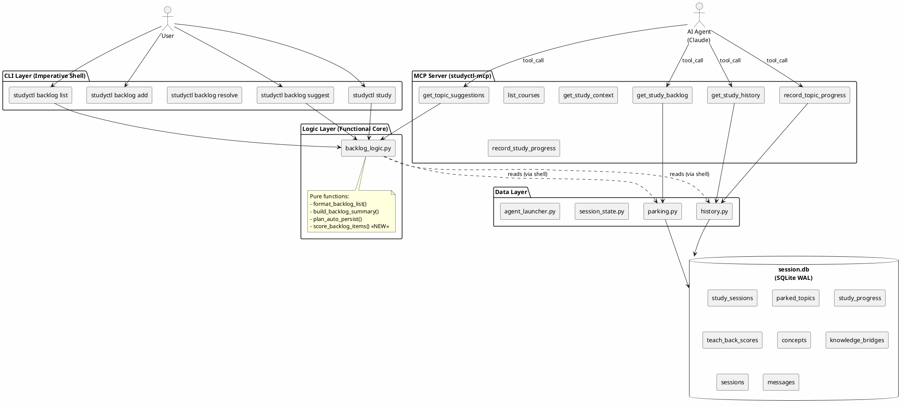
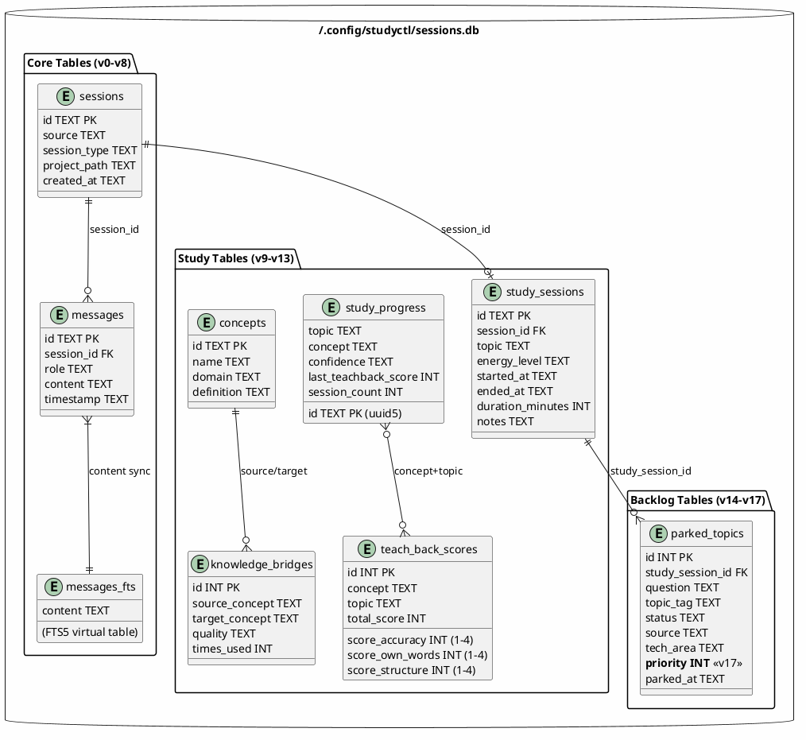
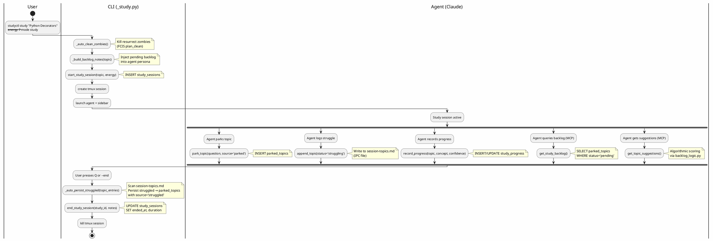
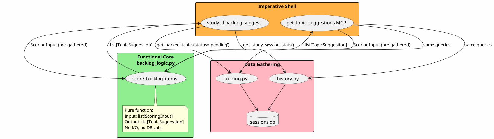
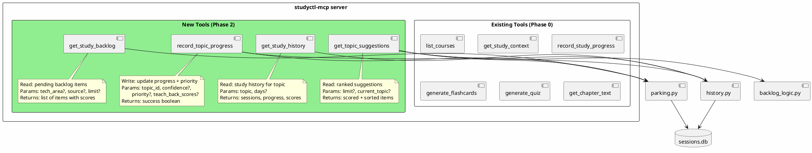
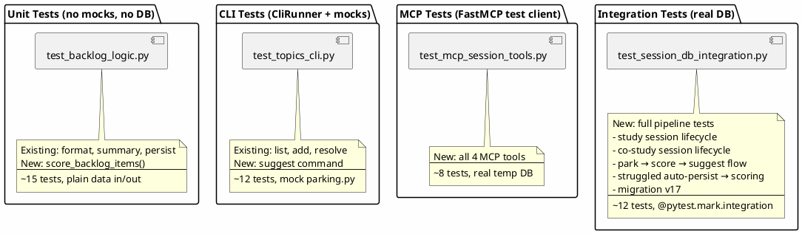
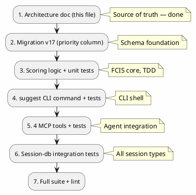

# Study Backlog Phase 2 — AI Prioritization + Session-DB Integration

*Source of truth for implementation, MCP integration, and test design.*

## 1. System Overview

Phase 2 adds AI-driven topic prioritization and full session-db MCP integration. The agent gains direct read/write access to the session database, enabling real-time topic scoring and study history queries during live sessions.



## 2. Session-DB Architecture

The session database is the **central data store** for all study state. It uses SQLite WAL mode for concurrent read/write from CLI, MCP server, and background processes.



## 3. Session Types and Data Flow



### Session Types

| Mode | CLI Flag | Timer Default | Description |
|------|----------|--------------|-------------|
| `study` | `--mode study` (default) | elapsed | Solo study with AI mentor |
| `co-study` | `--mode co-study` | pomodoro | Collaborative study session |

Both modes flow through the same data pipeline — the mode affects only the agent persona and timer behaviour, not the DB schema.

### Imported Session Types

`sessions.session_type` is auto-classified by `classifier.py` post-import:

| Type | Source |
|------|--------|
| `claude_code` | Claude Code conversations |
| `kiro_cli` | Kiro CLI sessions |
| `gemini` | Gemini CLI |
| `aider` | Aider chat history |
| `litellm` | LiteLLM proxy logs |

## 4. Scoring Pipeline (FCIS)



### Scoring Model

```python
@dataclass
class ScoringInput:
    """Pre-gathered data for a single backlog item."""
    item: BacklogItem
    frequency: int           # count of times this topic appears in parked_topics
    priority: int | None     # agent-assessed importance (1-5), None = unassessed
    last_studied: str | None # ISO datetime from study_sessions


@dataclass
class TopicSuggestion:
    """A scored and ranked topic suggestion."""
    item: BacklogItem
    score: float             # 0.0 - 1.0, higher = study this next
    frequency: int
    priority: int            # effective priority (default 3 if unassessed)
    reasoning: str           # human-readable explanation of the score
```

**Score formula:**

```
effective_priority = priority if priority is not None else 3
normalized_frequency = min(frequency / max_frequency, 1.0)  # 0-1 range
normalized_priority = effective_priority / 5.0               # 0-1 range

score = (0.4 * normalized_frequency) + (0.6 * normalized_priority)
```

Importance weighs 60%, frequency 40% — fundamental topics rank higher even if they've only been parked once.

## 5. MCP Tools Specification



### Tool Signatures

```python
@mcp.tool()
def get_study_backlog(
    tech_area: str | None = None,
    source: str | None = None,
    status: str = "pending",
    limit: int = 20,
) -> dict[str, Any]:
    """Get study backlog items with optional filters."""


@mcp.tool()
def get_topic_suggestions(
    limit: int = 10,
    current_topic: str | None = None,
) -> dict[str, Any]:
    """Get AI-ranked topic suggestions based on frequency and importance."""


@mcp.tool()
def get_study_history(
    topic: str,
    days: int = 30,
) -> dict[str, Any]:
    """Get study history for a topic: sessions, progress, teach-back scores."""


@mcp.tool()
def record_topic_progress(
    topic_id: int,
    priority: int | None = None,
    confidence: str | None = None,
    notes: str | None = None,
) -> dict[str, Any]:
    """Update a backlog topic's priority or mark progress."""
```

## 6. Test Architecture



### Test Matrix

| Test File | Layer | What It Tests | Mocks? | DB? |
|-----------|-------|---------------|--------|-----|
| `test_backlog_logic.py` | Unit | scoring, formatting, persist planning | None | No |
| `test_topics_cli.py` | CLI | suggest command output + args | parking.py | No |
| `test_mcp_session_tools.py` | MCP | 4 new tools via test client | None | Yes (tmp) |
| `test_session_db_integration.py` | Integration | Full session lifecycle for all types | None | Yes (tmp) |

## 7. Implementation Order



## 8. File Inventory

| File | Action | Description |
|------|--------|-------------|
| `agent-session-tools/.../migrations.py` | Modify | Add migration v17 (priority column) |
| `studyctl/backlog_logic.py` | Modify | Add `score_backlog_items()`, `ScoringInput`, `TopicSuggestion` |
| `studyctl/parking.py` | Modify | Add `update_topic_priority()`, `get_topic_frequency()` |
| `studyctl/cli/_topics.py` | Modify | Add `suggest` subcommand |
| `studyctl/mcp/tools.py` | Modify | Register 4 new MCP tools |
| `tests/test_backlog_logic.py` | Modify | Add scoring tests |
| `tests/test_topics_cli.py` | Modify | Add suggest CLI tests |
| `tests/test_mcp_session_tools.py` | **Create** | MCP tool tests |
| `tests/test_session_db_integration.py` | **Create** | Full lifecycle integration tests |
| `tests/test_parking.py` | Modify | Update fixture for v17 |
| `tests/test_cli_session.py` | Modify | Update fixture for v17 |
