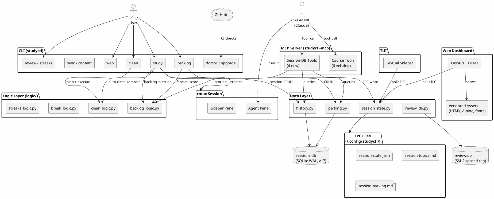
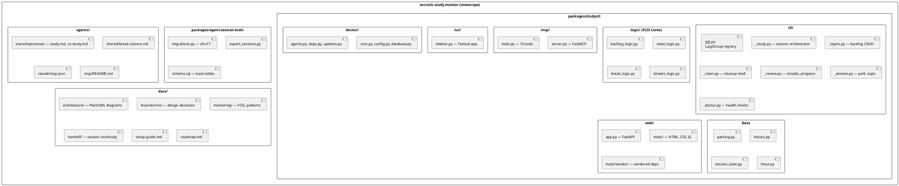
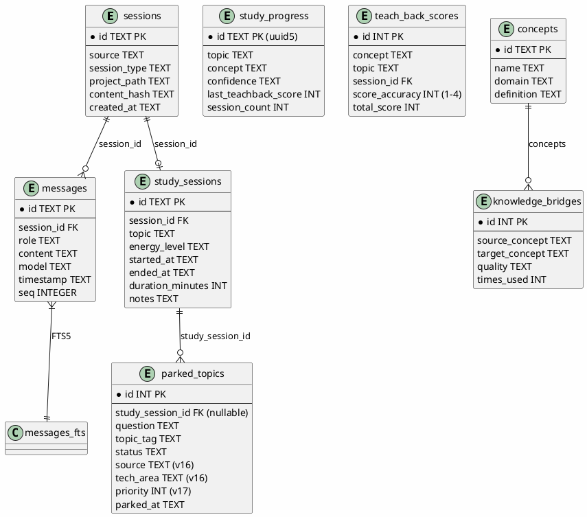
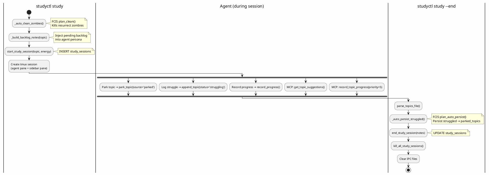
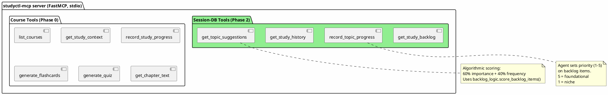

# System Architecture — Socratic Study Mentor

*Source of truth for the overall system architecture. Updated 2026-04-03.*

## 1. High-Level Architecture



## 2. Package Structure



## 3. Session-DB Schema (v17)



## 4. Data Flow — Study Session Lifecycle



## 5. MCP Tools (10 total)



## 6. FCIS Pattern Usage

| Module | Functional Core | Imperative Shell | Tests |
|--------|----------------|-----------------|-------|
| Clean | `logic/clean_logic.py` → `plan_clean()` | `cli/_clean.py` | `test_clean.py` (17, zero mocks) |
| Backlog | `logic/backlog_logic.py` → `format_backlog_list()`, `score_backlog_items()`, `plan_auto_persist()`, `build_backlog_summary()` | `cli/_topics.py`, `cli/_study.py` | `test_backlog_logic.py` (22, zero mocks) |
| Break | `logic/break_logic.py` → `check_break_needed()`, energy-adaptive thresholds | `tui/sidebar.py` (BreakBanner widget) | `test_break_logic.py` (23, zero mocks) |
| Streaks | `logic/streaks_logic.py` → `analyze_energy_streaks()`, trend detection, duration correlation | `cli/_review.py` | `test_streaks_logic.py` (12, zero mocks) |

**Note**: All FCIS cores live in `studyctl/logic/` subpackage with an empty `__init__.py` (explicit imports, no re-exports). This was created per the 2026-04-03 architecture review recommendation.

## 7. Test Pyramid

```
CI-safe tests (no tmux, no network):     826
Integration tests (real DB):              13
UAT tests (needs tmux):                   57
─────────────────────────────────────────────
Total:                                   896
```

## 8. Current Status & Roadmap

### Completed (v2.2 partial)
- [x] `studyctl clean` command (FCIS)
- [x] tmux-resurrect compatibility (auto-clean + doctor + docs)
- [x] Study Backlog Phase 1 (CRUD, auto-persist, agent injection)
- [x] Study Backlog Phase 2 (scoring, MCP tools, integration tests)
- [x] Vendor HTMX + Alpine.js + OpenDyslexic (offline PWA)
- [x] Schema v17 (source, tech_area, priority columns)

### Completed (v2.2 polish — 2026-04-03)
- [x] **Structural cleanup**: `logic/` subpackage for FCIS cores, service layer fully wired
- [x] **Self-healing DB**: `parking.py:_connect()` two-tier fallback for schema drift
- [x] Break suggestions at timer thresholds (BreakBanner widget + IPC)
- [x] Energy streaks correlation (trend detection, duration analysis)
- [x] Register MCP tools in agent persona (10 tools documented)
- [x] Vendor Google Fonts Inter (zero CDN dependencies, offline PWA)
- [x] Nested tmux UAT test (switch_client path verified)
- [x] `--end` UAT test from outside (kill + cleanup verified)

### Architecture Debt (from 2026-04-03 review)
- [x] Unify config systems — already unified on YAML; removed dead JSON fallback from config_loader.py
- [x] Split `query_sessions.py` monolith → `query_logic.py` (717 lines) + CLI (505 lines)
- [x] Fix CI test failures — `test_cli_session.py` missing `_find_db` patch for headless environments
- [ ] Nightly CI job for UAT tests (macOS runner with tmux) — deferred to Phase 6
- [ ] Fix VSCode circular import — deferred, low priority (no active VSCode users)

### Future Phases
- Phase 6: CI/CD improvements (includes architecture debt above)
- Phase 3: Devices (ttyd + LAN)
- Multi-Agent Support
- Full MCP Agent Integration
