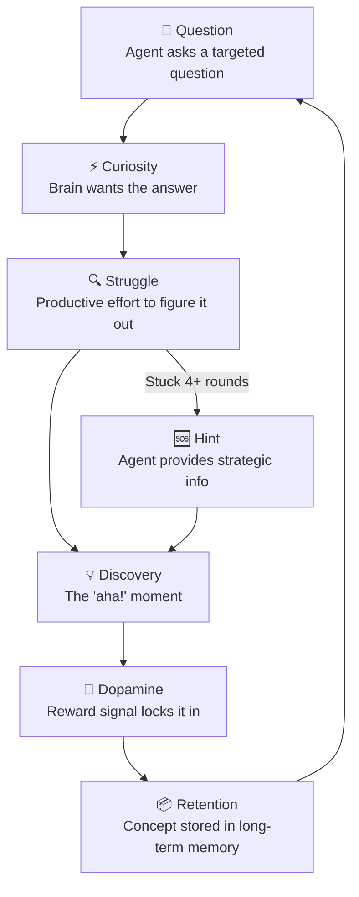

# AuDHD Learning Philosophy

The thinking behind how this toolkit teaches — and why it works differently.

## Table of Contents

- [Why This Exists](#why-this-exists)
- [The Socratic Method for AuDHD](#the-socratic-method-for-audhd)
- [Core Principles](#core-principles)
- [Dopamine-Driven Learning Loop](#dopamine-driven-learning-loop)
- [Spaced Repetition for ADHD](#spaced-repetition-for-adhd)
- [Network→Data Engineering Bridges](#networkdata-engineering-bridges)
- [Body Doubling Sessions](#body-doubling-sessions)
- [Customizing for Your Brain](#customizing-for-your-brain)

## Why This Exists

Traditional learning tools assume a neurotypical brain: sit down, read linearly, retain through willpower. That doesn't work for AuDHD brains. We need:

- **Dopamine to engage** — passive reading doesn't generate it, discovery does
- **Structure without rigidity** — frameworks that flex with energy levels
- **Explicit connections** — we don't infer relationships, we need them stated
- **Short chunks** — working memory fills fast, so break everything down
- **Repetition through variation** — same concept, different angles, not rote drilling

This toolkit builds those needs directly into the AI mentor's behaviour.

## The Socratic Method for AuDHD

The Socratic method — teaching through questions rather than lectures — is unusually effective for ADHD brains. Here's why:

**Questions create curiosity gaps.** When someone asks "what do you think happens if...?", your brain wants the answer. That wanting is dopamine. Lectures don't create that pull.

**Discovery is more memorable than instruction.** When you figure something out yourself (even with heavy guidance), it sticks. When someone tells you, it evaporates.

**Questions force active processing.** ADHD brains zone out during passive input. Questions demand a response — they keep you in the loop.

The agents in this toolkit follow a 70/30 rule: 70% questions, 30% strategic information drops. They never give direct answers unless you're stuck after multiple attempts or explicitly ask.

## Core Principles

### Hands-on first, theory after

Show working code, then explain why it works. The AuDHD brain needs something concrete to anchor abstract concepts to.

### One concept at a time

Don't bundle. Introduce one idea, let it land, check understanding, then move on. Bundling overloads working memory and nothing sticks.

### Explicit connections between concepts

"This is like X you already know." The agents use analogies from networking and infrastructure to bridge into data engineering and Python concepts. Never assume the learner will make the connection themselves.

### Short, focused chunks

Walls of text lose attention. Every explanation uses:
- Headers and bullet points
- TL;DR at the top, detail below
- Mermaid diagrams for anything with flow or structure
- Max 3-4 concepts per explanation

### Repetition through variation

Show the same concept applied in different contexts. Not "here's the Strategy pattern again" but "here's the Strategy pattern in a data pipeline, now in a CLI tool, now in a test suite."

### Direct and literal communication

No ambiguity. No implied meaning. Say exactly what you mean. If something is wrong, say it's wrong — don't soften it into uselessness.

## Dopamine-Driven Learning Loop

The agents are designed around this cycle:

The key insight: **productive struggle is the point, not a bug.** The agents deliberately withhold answers to create the conditions for discovery. But they also watch for frustration — if you're stuck too long, they step in before the dopamine crash.

## Spaced Repetition for ADHD

ADHD brains forget fast but respond well to structured review. The toolkit uses a 5-interval schedule:

| Days Since Study | Review Type | Duration | Why This Works |
|-----------------|-------------|----------|----------------|
| 1 day | 5-min recall quiz | 5 min | Catches it before it fades |
| 3 days | 10-min Socratic review | 10 min | Reinforces while still fresh |
| 7 days | 15-min deep review | 15 min | Moves to medium-term memory |
| 14 days | Apply to new problem | 20 min | Tests transfer, not just recall |
| 30 days | Teach-back session | 15 min | If you can teach it, you know it |

`studyctl review` checks your session history and tells you what's due. The agent uses this at the start of every session to prioritise overdue topics.

Why this works for ADHD:
- **External structure** — you don't have to remember to review, the system tells you
- **Varied review types** — not the same flashcard drill every time
- **Short sessions** — 5-20 minutes, not hour-long study blocks
- **Teach-back** — explaining to the AI agent is a form of active recall

## Network→Data Engineering Bridges

If you're coming from a networking/infrastructure background, the agents use concept bridges to connect what you know to what you're learning:

| You Know (Networking) | Maps To (Data Engineering) | Why It's Similar |
|----------------------|---------------------------|------------------|
| BGP route propagation | Event streaming (Kafka) | Both propagate state changes across distributed systems |
| VLANs / network segmentation | Data lake zones (raw/curated/enriched) | Both isolate and organise by trust/quality level |
| Load balancer health checks | Data quality checks | Both validate before forwarding to consumers |
| DNS resolution | Schema registry | Both translate names to structured definitions |
| Packet fragmentation/reassembly | Partitioning/compaction | Both break data into manageable chunks for transport |
| Firewall rules | Column-level security (Lake Formation) | Both control access at a granular level |
| OSPF areas | Spark partitions | Both divide a large domain into manageable units |

The agents reference these bridges when introducing new concepts. Instead of "Kafka is a distributed streaming platform", you get "Kafka propagates events the way BGP propagates routes — what parallels do you see?"

## Body Doubling Sessions

Body doubling is an ADHD strategy where having someone present (even virtually) helps you focus. The agents support this:

- **Low-energy mode**: The agent acts as a quiet presence. It checks in periodically ("still going?", "what are you working on?") without demanding deep engagement
- **Accountability check-ins**: "You said you'd work on X for 25 minutes. How's it going?"
- **Pomodoro-style structure**: The agent can time-box sessions and prompt breaks
- **No judgment**: If you got distracted, the agent redirects without commentary

Start a body doubling session by telling the agent your energy level is low (1-3 out of 10). It'll switch to a supportive, low-demand mode.

## Customizing for Your Brain

Every AuDHD brain is different. Here's how to adapt the agents:

### Adjust questioning intensity

If 70% questions feels too intense, edit the agent persona to shift the ratio. Some days you need more direct instruction — that's fine.

### Change the concept bridges

The default bridges assume a networking background. If you're coming from a different domain, edit `agents/kiro/skills/audhd-socratic-mentor/references/network-bridges.md` to use analogies from your experience.

### Modify session types

The agents support multiple session types (deep study, light review, body doubling). Edit the study-mentor skill to add your own or adjust the energy-level thresholds.

### Tune spaced repetition intervals

The 1/3/7/14/30 day schedule is a starting point. If you find concepts fading faster, tighten the early intervals. The schedule is defined in `packages/studyctl/src/studyctl/history.py`.

### Add study topics

Edit `~/.config/studyctl/config.yaml` to add new topics. Each topic needs a name, slug, and Obsidian path. See the [Setup Guide](setup-guide.md) for details.
