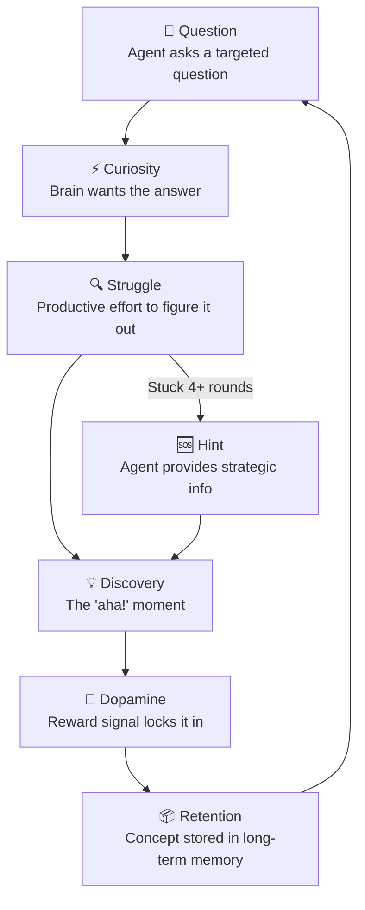
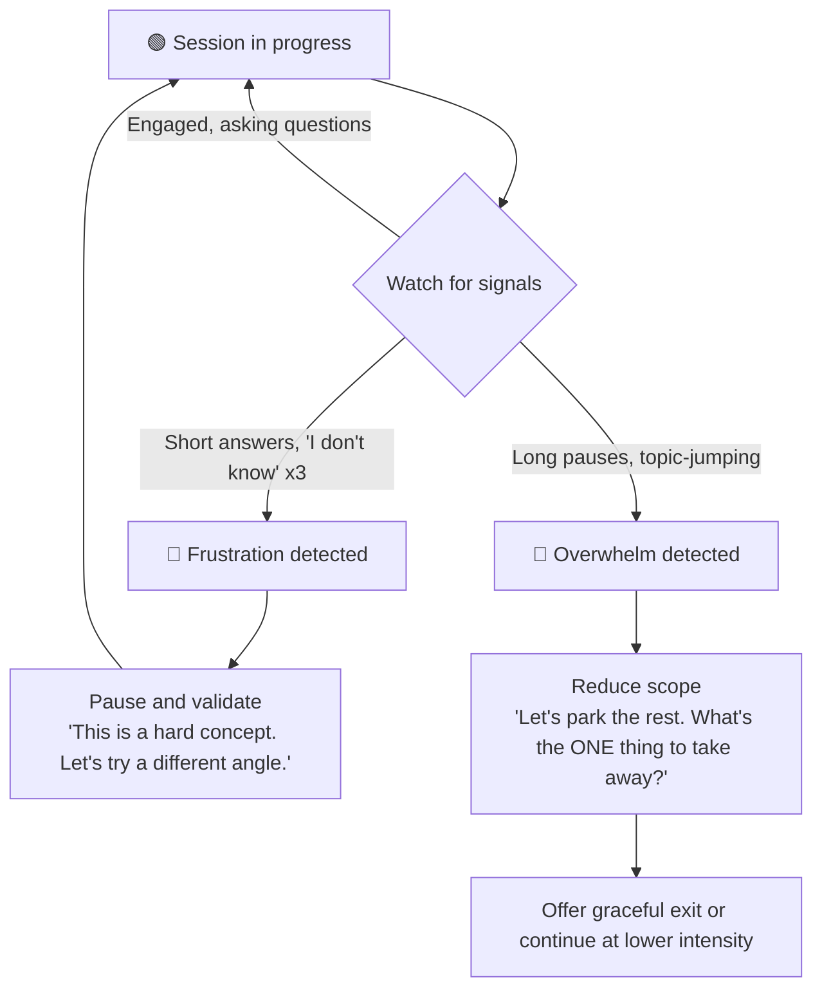
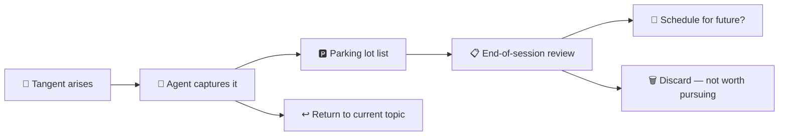

# AuDHD Learning Philosophy

The thinking behind how this toolkit teaches — and why it works differently.

## Table of Contents

- [Why This Exists](#why-this-exists)
- [The Socratic Method for AuDHD](#the-socratic-method-for-audhd)
- [Core Principles](#core-principles)
- [Dopamine-Driven Learning Loop](#dopamine-driven-learning-loop)
- [Spaced Repetition for ADHD](#spaced-repetition-for-adhd)
- [Network→Data Engineering Bridges](#networkdata-engineering-bridges)
- [Body Doubling Sessions](#body-doubling-sessions)
- [Emotional Regulation](#emotional-regulation)
- [Transition Support](#transition-support)
- [The Parking Lot](#the-parking-lot)
- [Sensory Environment](#sensory-environment)
- [Micro-Celebrations](#micro-celebrations)
- [Interleaving](#interleaving)
- [Customizing for Your Brain](#customizing-for-your-brain)

## Why This Exists

Traditional learning tools assume a neurotypical brain: sit down, read linearly, retain through willpower. That doesn't work for AuDHD brains. We need:

- **Dopamine to engage** — passive reading doesn't generate it, discovery does
- **Structure without rigidity** — frameworks that flex with energy levels
- **Explicit connections** — we don't infer relationships, we need them stated
- **Short chunks** — working memory fills fast, so break everything down
- **Repetition through variation** — same concept, different angles, not rote drilling

This toolkit builds those needs directly into the AI mentor's behaviour.

## The Socratic Method for AuDHD

The Socratic method — teaching through questions rather than lectures — is unusually effective for ADHD brains. Here's why:

**Questions create curiosity gaps.** When someone asks "what do you think happens if...?", your brain wants the answer. That wanting is dopamine. Lectures don't create that pull.

**Discovery is more memorable than instruction.** When you figure something out yourself (even with heavy guidance), it sticks. When someone tells you, it evaporates.

**Questions force active processing.** ADHD brains zone out during passive input. Questions demand a response — they keep you in the loop.

The agents in this toolkit follow a 70/30 rule: 70% questions, 30% strategic information drops. They never give direct answers unless you're stuck after multiple attempts or explicitly ask.

## Core Principles

### Hands-on first, theory after

Show working code, then explain why it works. The AuDHD brain needs something concrete to anchor abstract concepts to.

### One concept at a time

Don't bundle. Introduce one idea, let it land, check understanding, then move on. Bundling overloads working memory and nothing sticks.

### Explicit connections between concepts

"This is like X you already know." The agents use analogies from networking and infrastructure to bridge into data engineering and Python concepts. Never assume the learner will make the connection themselves.

### Short, focused chunks

Walls of text lose attention. Every explanation uses:
- Headers and bullet points
- TL;DR at the top, detail below
- Mermaid diagrams for anything with flow or structure
- Max 3-4 concepts per explanation

### Repetition through variation

Show the same concept applied in different contexts. Not "here's the Strategy pattern again" but "here's the Strategy pattern in a data pipeline, now in a CLI tool, now in a test suite."

### Direct and literal communication

No ambiguity. No implied meaning. Say exactly what you mean. If something is wrong, say it's wrong — don't soften it into uselessness.

## Dopamine-Driven Learning Loop

The agents are designed around this cycle:

The key insight: **productive struggle is the point, not a bug.** The agents deliberately withhold answers to create the conditions for discovery. But they also watch for frustration — if you're stuck too long, they step in before the dopamine crash.

## Spaced Repetition for ADHD

ADHD brains forget fast but respond well to structured review. The toolkit uses a 5-interval schedule:

| Days Since Study | Review Type | Duration | Why This Works |
|-----------------|-------------|----------|----------------|
| 1 day | 5-min recall quiz | 5 min | Catches it before it fades |
| 3 days | 10-min Socratic review | 10 min | Reinforces while still fresh |
| 7 days | 15-min deep review | 15 min | Moves to medium-term memory |
| 14 days | Apply to new problem | 20 min | Tests transfer, not just recall |
| 30 days | Teach-back session | 15 min | If you can teach it, you know it |

`studyctl review` checks your session history and tells you what's due. The agent uses this at the start of every session to prioritise overdue topics.

Why this works for ADHD:
- **External structure** — you don't have to remember to review, the system tells you
- **Varied review types** — not the same flashcard drill every time
- **Short sessions** — 5-20 minutes, not hour-long study blocks
- **Teach-back** — explaining to the AI agent is a form of active recall

## Network→Data Engineering Bridges

If you're coming from a networking/infrastructure background, the agents use concept bridges to connect what you know to what you're learning:

| You Know (Networking) | Maps To (Data Engineering) | Why It's Similar |
|----------------------|---------------------------|------------------|
| BGP route propagation | Event streaming (Kafka) | Both propagate state changes across distributed systems |
| VLANs / network segmentation | Data lake zones (raw/curated/enriched) | Both isolate and organise by trust/quality level |
| Load balancer health checks | Data quality checks | Both validate before forwarding to consumers |
| DNS resolution | Schema registry | Both translate names to structured definitions |
| Packet fragmentation/reassembly | Partitioning/compaction | Both break data into manageable chunks for transport |
| Firewall rules | Column-level security (Lake Formation) | Both control access at a granular level |
| OSPF areas | Spark partitions | Both divide a large domain into manageable units |

The agents reference these bridges when introducing new concepts. Instead of "Kafka is a distributed streaming platform", you get "Kafka propagates events the way BGP propagates routes — what parallels do you see?"

## Body Doubling Sessions

Body doubling is an ADHD strategy where having someone present (even virtually) helps you focus. The agents support this:

- **Low-energy mode**: The agent acts as a quiet presence. It checks in periodically ("still going?", "what are you working on?") without demanding deep engagement
- **Accountability check-ins**: "You said you'd work on X for 25 minutes. How's it going?"
- **Pomodoro-style structure**: The agent can time-box sessions and prompt breaks
- **No judgment**: If you got distracted, the agent redirects without commentary

Start a body doubling session by telling the agent your energy level is low (1-3 out of 10). It'll switch to a supportive, low-demand mode.

### Energy Scale

The energy scale distinguishes between low-energy and shutdown states:

| Energy Level | State | Agent Behaviour |
|-------------|-------|-----------------|
| 1-3 | Low energy but functional | Lighter review, more scaffolding, shorter chunks, body doubling mode available |
| 0 | Shutdown/meltdown adjacent | Gentle exit protocol — no study content, no questions, just presence. "Not a study day. That's OK." |

Energy 0 is not "very low energy." It's a qualitatively different state. The agent does not attempt to teach, quiz, or motivate. It acknowledges, offers to sit quietly, and suggests closing the session when ready.

### Async Body Doubling

Distinct from active body doubling, async body doubling is for when you're not studying — you're working, doing chores, or just existing, but want the accountability of someone checking in.

- Tell the agent: "I'm not studying right now, just working. Check in on me."
- The agent sends periodic low-demand check-ins: "Still going?", "How's it going over there?", "Need anything?"
- No teaching content, no questions about concepts, no study pressure
- Useful for task initiation struggles — sometimes you just need someone "in the room"
- End it whenever: "Done for now" or just stop responding

## Emotional Regulation

AuDHD brains don't have a neutral gear. Emotional state directly affects what kind of learning is possible — or whether learning is possible at all.

### Pre-Study Emotional Check

At the start of every session, the agent asks: "How are you arriving today?" The response maps to an adaptive strategy:

| Emotional State | Agent Response |
|----------------|----------------|
| 😌 **Calm** | Full Socratic mode — questions, productive struggle, normal pacing |
| 😰 **Anxious** | Slower pace, more scaffolding, frequent check-ins. "Let's start with something you already know to build momentum." |
| 😤 **Frustrated** | Validate first, then redirect. "That sounds rough. Want to channel it into something satisfying — like fixing a bug?" Short, concrete tasks with quick wins. |
| 😶 **Flat** | Low-demand mode. Review over new material. More showing, less asking. "Let's just look at some code together." |
| 🤯 **Overwhelmed** | Triage mode. "Let's pick ONE thing. Just one. What feels most urgent?" Reduce scope aggressively. |
| 🔇 **Shutdown** | No teaching. No questions. "Not a study day. That's OK. I'm here if you want to sit quietly." Exit when ready. |

### Shutdown Protocol

Shutdown is not low energy. It's a nervous system state where cognitive load causes harm. The agent:

- Does not attempt to teach, quiz, or redirect
- Does not say "let's try something easy" — there is no easy enough
- Acknowledges the state without judgment
- Offers quiet presence or a clean exit
- Optionally logs the day so spaced repetition doesn't penalise the gap

### Mid-Session Emotional Shifts

The agent watches for signs of frustration or overwhelm during a session:

The agent doesn't announce "I've detected you're frustrated." It adapts naturally — changes approach, offers a break, or shifts to lighter material.

## Transition Support

### Attention Residue

When you sit down to study, your brain is still processing whatever you were doing before — a work problem, a conversation, doom-scrolling. This is attention residue, and it's stronger in ADHD brains. Jumping straight into complex material while carrying residue means nothing sticks.

### 2-Minute Grounding Ritual

Every session starts with a brief transition to help your brain arrive:

1. **Park the previous context**: "What were you just doing? Let's acknowledge it and set it aside."
2. **Reconnect to study context**: "Name 3 things from your last session." (This doubles as spaced repetition.)
3. **Set a micro-intention**: "What's ONE thing you want to understand better by the end of this session?"

Examples of grounding prompts:
- "You were just in a meeting — what's still rattling around? Let's park it."
- "Last session you were working on SQL window functions. What do you remember?"
- "Before we dive in: on a scale of 1-10, how present do you feel right now?"

The ritual is short by design. Two minutes, not ten. Just enough to create a boundary between "before" and "now."

## The Parking Lot

AuDHD brains generate tangential ideas constantly. Mid-explanation, you'll think "oh, but what about X?" and if you don't capture it, two things happen: you lose the thought (anxiety), or you chase it (derailment).

The parking lot solves both:

- **Agent captures tangents in real-time**: "Interesting — parking that for later: [topic]. Back to [current]."
- **No judgment about the tangent** — it might be genuinely valuable, just not right now
- **Running list maintained during the session** — nothing is lost
- **Surfaced at end of session**: "From today's parking lot: [X], [Y], [Z]. Want to schedule any of those?"
- **Optionally fed into spaced repetition** — parked topics can become future session seeds

This reduces the anxiety of losing an interesting thought while preventing the session from fragmenting. The key is that the agent does the capturing — you don't have to break flow to write it down.

## Sensory Environment

Sensory context affects what kind of learning is possible. The agent does a quick environment check at session start:

| Environment | Adaptation |
|------------|------------|
| 🔇 **Quiet space** | Deeper dives OK. Longer explanations. More complex problems. |
| 🔊 **Noisy environment** | Shorter chunks. More visual (diagrams, code). Less reading-heavy. Quick-fire Q&A over long Socratic chains. |
| 🎧 **Headphones on** | Treat as quiet — focused mode available. |
| 🔈 **Speakers** | Assume potential interruptions. Save state more frequently. |
| 🪑 **At desk** | Full study mode available. |
| 🛋️ **On couch/bed** | Lighter review. No deep problem-solving. Good for spaced repetition recall or parking lot review. |

The agent asks once and adapts. It doesn't ask again unless you mention a change ("moved to a café").

## Micro-Celebrations

Long sessions without dopamine hits cause dropout. The gap between "started learning" and "finished learning" is where ADHD brains bail — not because the material is hard, but because there's no reward signal.

Micro-celebrations inject small dopamine hits throughout:

- **Progress markers every 2-3 exchanges**: "✓ Step 2 of 5 — you've got the base case down."
- **Explicit skill acknowledgment**: "You just used a list comprehension without being prompted. That's new."
- **End-of-section summaries**: "You just learned X, Y, and Z. That's 3 new concepts in 15 minutes."
- **Streak tracking**: "This is your 4th session this week. Consistency is the hard part and you're doing it."
- **Difficulty acknowledgment**: "That was a genuinely hard problem. Most people struggle with recursion — you got it in 3 attempts."

The celebrations are factual, not performative. "Good job!" means nothing. "You just debugged a generator pipeline by tracing the yield points — that's intermediate Python" means everything.

## Interleaving

Interleaving means mixing related topics within a single session instead of blocking one topic at a time. Research shows it improves transfer and retention — and it maps perfectly to AuDHD novelty-seeking.

### Why it works for AuDHD brains

- **Novelty**: Switching topics every 10-15 minutes keeps dopamine flowing
- **Pattern recognition**: Seeing connections across topics is where AuDHD brains excel
- **Reduced boredom**: The number one session killer

### How the agent uses it

The agent checks your spaced repetition schedule and looks for topics that share underlying patterns:

| Topic A (Due) | Topic B (Due) | Shared Pattern |
|--------------|--------------|----------------|
| Python decorators | SQL views | Both wrap/transform without modifying the original |
| Generator pipelines | Spark lazy evaluation | Both defer computation until results are needed |
| pytest fixtures | dbt sources | Both set up known state before the real work |
| Context managers | Database transactions | Both guarantee cleanup regardless of what happens inside |

The agent offers interleaving when multiple topics are due: "Python decorators and SQL views are both up for review. Want to mix them? The pattern-matching transfers."

You can always decline — "just decorators today" is a valid answer. Interleaving is a tool, not a mandate.

## Customizing for Your Brain

Every AuDHD brain is different. Here's how to adapt the agents:

### Adjust questioning intensity

If 70% questions feels too intense, edit the agent persona to shift the ratio. Some days you need more direct instruction — that's fine.

### Change the concept bridges

The default bridges assume a networking background. If you're coming from a different domain, run `studyctl config init` to configure your primary expertise domain. The AI agents will then use your configured domain to draw analogies during Socratic sessions.

### Modify session types

The agents support multiple session types (deep study, light review, body doubling). Edit the study-mentor skill to add your own or adjust the energy-level thresholds.

### Tune spaced repetition intervals

The 1/3/7/14/30 day schedule is a starting point. If you find concepts fading faster, tighten the early intervals. The schedule is defined in `packages/studyctl/src/studyctl/history/progress.py`.

### Add study topics

Edit `~/.config/studyctl/config.yaml` to add new topics. Each topic needs a name, slug, and Obsidian path. See the [Setup Guide](setup-guide.md) for details.
