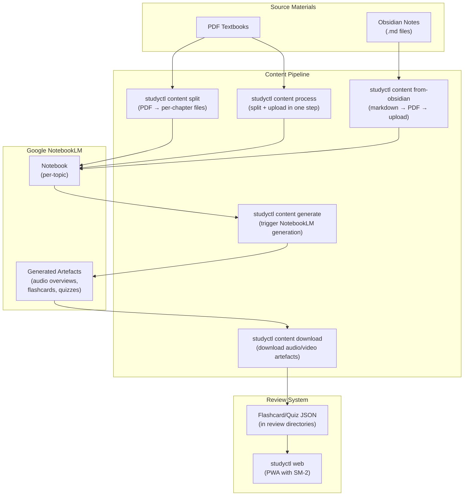
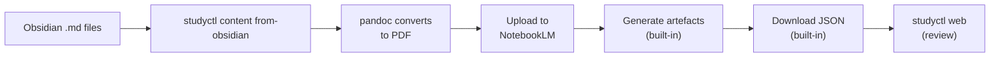

# Content Pipeline Guide

> From raw materials (Obsidian notes, PDF textbooks) to study-ready flashcards and quizzes via Google NotebookLM.

---

## How It Works

There are two paths into the pipeline. Both end at the same place: flashcard and quiz JSON files ready for spaced repetition review.



---

## Path 1: PDF Textbook to Flashcards

Use this when you have a PDF ebook or textbook and want to create study materials from it.

### Step 1: Split the PDF into chapters

```bash
studyctl content split "Computer-Science-APP.pdf" -o chapters/
```

This reads the PDF's table of contents (bookmarks) and splits it into one file per chapter. Use `-l 2` to split at heading level 2 instead of the default level 1.

If the PDF has no bookmarks, use `--ranges` to specify page ranges manually:

```bash
studyctl content split "textbook.pdf" --ranges "1-30,31-60,61-90"
```

### Step 2: Upload chapters to NotebookLM

```bash
studyctl content process "Computer-Science-APP.pdf" \
    -o chapters/ \
    -n "$NOTEBOOKLM_NOTEBOOK_ID"
```

This combines split + upload in one command. It splits the PDF, then uploads each chapter as a source to the specified NotebookLM notebook.

If you already split in step 1, you can upload manually via the NotebookLM web UI instead.

### Step 3: Generate audio overviews and artefacts

```bash
studyctl content generate \
    -n "$NOTEBOOKLM_NOTEBOOK_ID" \
    -c 1-5
```

This triggers NotebookLM to generate audio overviews for chapters 1-5. Generation takes 15+ minutes per chapter for slides/video types.

Flags:
- `-c / --chapters` — chapter range (e.g. `1-5`, `3`, `1-12`)
- `--no-audio` — skip audio overview generation
- `--no-video` — skip video generation
- `-t / --timeout` — timeout in seconds (default: 900)

### Step 4: Download the generated artefacts

```bash
studyctl content download \
    -n "$NOTEBOOKLM_NOTEBOOK_ID" \
    -o ~/study-materials/csapp/ \
    -c 1-5
```

This downloads the generated audio, video, flashcard, and quiz files to the specified output directory. The JSON flashcard and quiz files are what the review system reads.

### Step 5: Review with spaced repetition

```bash
studyctl web
```

Open the PWA in your browser. Your downloaded flashcards and quizzes will appear as a course. See the [Web UI Guide](web-ui-guide.md) for the full review walkthrough.

---

## Path 2: Obsidian Notes to Flashcards

Use this when you have Obsidian markdown notes and want to create study materials from them.



### All-in-one command

```bash
studyctl content from-obsidian ~/Obsidian/2-Areas/Study/Python/ \
    -o ~/study-materials/python/ \
    -n "$NOTEBOOKLM_NOTEBOOK_ID"
```

This does everything in one step:

1. Converts each `.md` file to PDF via pandoc
2. Uploads PDFs as sources to NotebookLM
3. Generates audio overviews (unless `--no-generate`)
4. Downloads artefacts (unless `--no-download`)

### Selective flags

Skip steps you don't need:

```bash
# Convert and upload only (generate later)
studyctl content from-obsidian ~/notes/ -o output/ -n $NB_ID --no-generate

# Skip quiz/flashcard generation
studyctl content from-obsidian ~/notes/ -o output/ -n $NB_ID --no-quiz --no-flashcards

# Convert markdown to PDF only (no NotebookLM)
studyctl content from-obsidian ~/notes/ -o output/ --skip-convert
```

### Subdirectory filter

Process only notes from a specific subdirectory:

```bash
studyctl content from-obsidian ~/Obsidian/Study/ -s "Python/Decorators" -o output/
```

---

## Configuration

### NotebookLM notebook ID

Set via environment variable or pass with `-n`:

```bash
export NOTEBOOKLM_NOTEBOOK_ID="your-notebook-id-here"
```

Find the ID in the NotebookLM URL: `https://notebooklm.google.com/notebook/NOTEBOOK_ID`

### Content base path

Where flashcard/quiz JSON files are stored. Set in `~/.config/studyctl/config.yaml`:

```yaml
content:
  base_path: ~/study-materials    # default
  notebooklm_timeout: 900         # seconds per generation
  inter_episode_gap: 30           # seconds between API calls
```

### Topics mapping

Each topic maps to an Obsidian directory and a review path:

```yaml
topics:
  - name: Python
    slug: python
    obsidian_path: 2-Areas/Study/Python
    tags: [python, programming]
```

The `slug` determines where flashcards are stored: `{content.base_path}/{slug}/flashcards/`

---

## Syllabus Workflow (Batch Generation)

For large textbooks, use the syllabus workflow to generate episodes in batches:

```bash
# Create a generation plan
studyctl content syllabus -n $NB_ID -o chapters/ -b "CS:APP" -m 12

# Generate the next pending episode
studyctl content autopilot -o chapters/ -b "CS:APP"

# Check progress
studyctl content status -o chapters/ -b "CS:APP"
```

The autopilot command generates one episode at a time, respecting rate limits. Run it repeatedly (or on a cron) to work through the full book.

---

## Troubleshooting

| Problem | Cause | Fix |
|---------|-------|-----|
| `content generate` times out | NotebookLM generation takes 15+ min | Increase timeout: `-t 1800` |
| Daily quota exceeded | ~20-25 generations per day (Pro tier) | Wait 24h UTC for reset |
| Mermaid parse errors in `from-obsidian` | Special characters in diagram node labels | Non-fatal; ~15 diagrams may fail. Fix labels or ignore. |
| Double-nested output path | `from-obsidian` creates `pdfs/pdfs/` | Known issue; manually flatten or use `-o` to specify exact path |
| PDF has no bookmarks | `content split` needs TOC structure | Use `--ranges` for manual page ranges |

---

## Quick Reference

```bash
# List notebooks
studyctl content list

# List sources in a notebook
studyctl content list -n $NB_ID

# Split PDF by chapters
studyctl content split "book.pdf" -o chapters/

# Upload + split in one step
studyctl content process "book.pdf" -o chapters/ -n $NB_ID

# Generate audio/video
studyctl content generate -n $NB_ID -c 1-5

# Download artefacts
studyctl content download -n $NB_ID -o ~/study-materials/topic/

# Obsidian all-in-one
studyctl content from-obsidian ~/notes/ -o output/ -n $NB_ID

# Check review due dates
studyctl review

# Launch review PWA
studyctl web
```
