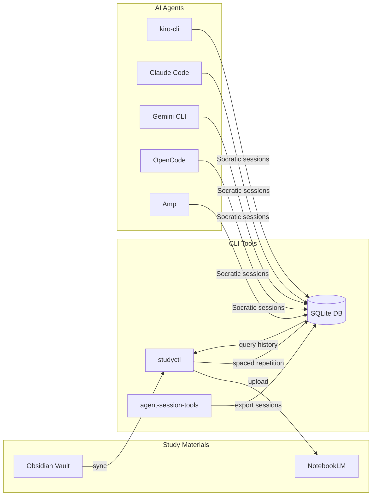

# Socratic Study Mentor

**TL;DR:** An AuDHD-aware study toolkit that teaches through Socratic questioning, tracks AI sessions across 7+ tools, and uses spaced repetition to fight imposter syndrome with evidence of progress.

---

## Quick Start

```bash
# 1. Clone and install
git clone https://github.com/NetDevAutomate/Socratic-Study-Mentor.git
cd socratic-study-mentor
./scripts/install.sh

# 2. Start a study session
kiro-cli chat --agent study-mentor   # or Claude Code: /agent socratic-mentor

# 3. Check what's due for review
studyctl review
```

!!! tip "First time?"
    Head to the [Setup Guide](setup-guide.md) for full installation details, then [Agent Installation](agent-install.md) to configure your AI tools.

---

## How It Works



---

## What's Inside

| Tool | Purpose |
|------|---------|
| **studyctl** | Study pipeline — sync notes, spaced repetition, struggle detection, win tracking |
| **agent-session-tools** | Export and search AI sessions from Claude Code, Kiro, Gemini, Aider, and more |
| **AI Agents** | Socratic mentors that adapt to your energy, emotional state, and sensory environment |

!!! energy-check "Designed for AuDHD brains"
    Every session starts with an energy + emotional state check. Low energy? Shorter chunks, more scaffolding. Shutdown? No teaching — just presence. Read the [AuDHD Philosophy](audhd-learning-philosophy.md) to understand why.

---

## Key Sections

- **[Session Protocol](session-protocol.md)** — How every study session flows, from arrival to close
- **[CLI Reference](cli-reference.md)** — Full command reference for `studyctl` and `session-query`
- **[AuDHD Framework](audhd-framework.md)** — The cognitive support framework behind the agents
- **[Network Bridges](network-bridges.md)** — Network→Data Engineering analogies for infrastructure people
- **[Roadmap](roadmap.md)** — What's coming next

!!! micro-celebration "You're here"
    Reading docs is the first step. That counts.
