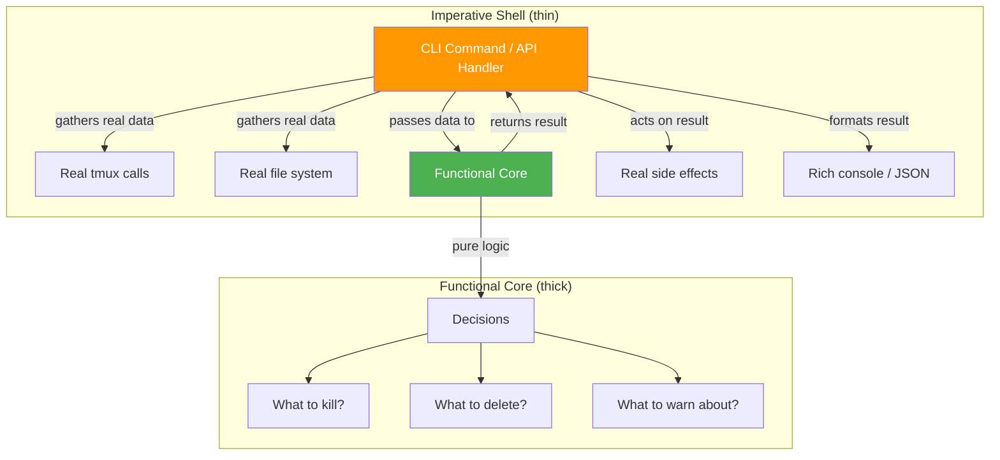
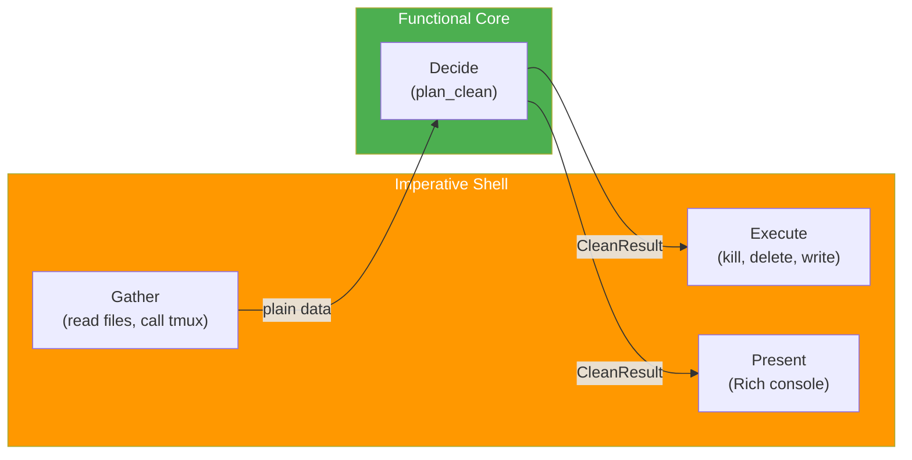
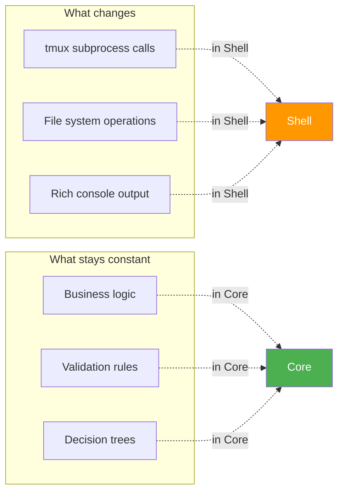
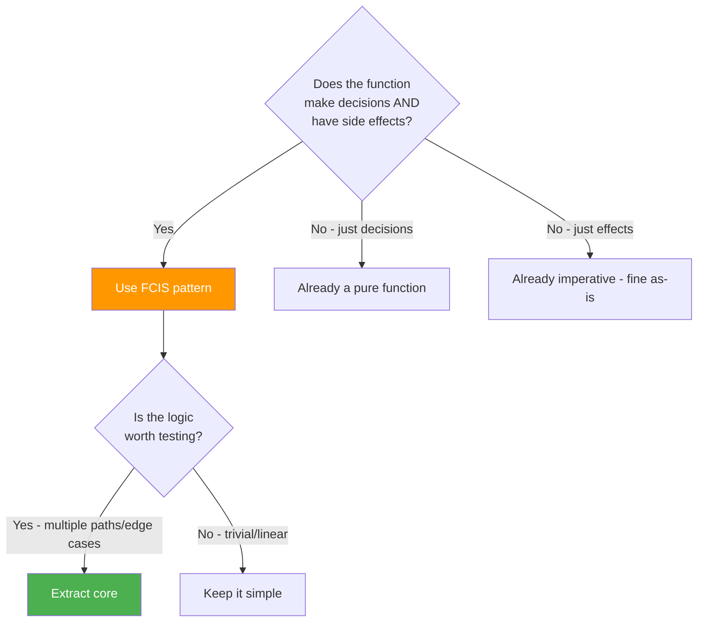
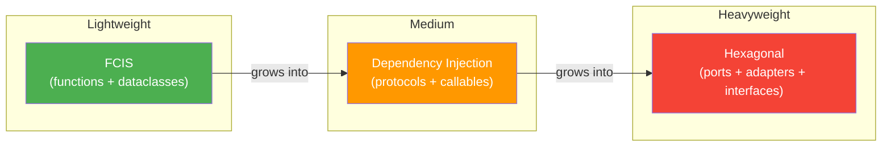

# Functional Core, Imperative Shell (FCIS)

*A practical guide for Python developers — with examples from this codebase.*

## The Problem

Most code tangles three concerns together:

1. **Business logic** — the decisions (should we kill this session? is this file stale?)
2. **Side effects** — the actions (delete files, kill processes, write to disk)
3. **Presentation** — the output (Rich console, JSON response, CLI exit codes)

When these are mixed in one function, testing requires mocking everything:

```python
# Tangled — hard to test
def clean(dry_run: bool) -> None:
    from studyctl.tmux import is_tmux_server_running, kill_session  # side effect
    from studyctl.cli._shared import console                        # presentation

    if is_tmux_server_running():           # side effect (subprocess call)
        for s in list_study_sessions():    # side effect (subprocess call)
            if is_zombie_session(s):       # side effect (subprocess call)
                console.print(f"Killing {s}")  # presentation
                kill_session(s)                 # side effect
```

To test whether zombie detection logic is correct, you must mock tmux, subprocess, Rich console, and file I/O. The test becomes a forest of `patch()` calls that test *wiring*, not *logic*.

## The Pattern

FCIS separates code into two layers:



| Layer | Does | Doesn't | Tests with |
|-------|------|---------|------------|
| **Functional Core** | Decides what to do | Touch the outside world | Plain asserts, no mocks |
| **Imperative Shell** | Gathers data, executes decisions | Contain business logic | Integration tests (optional) |

### The Key Insight

> The core takes **data in**, returns **data out**. It never calls subprocess, never reads files, never prints anything. All it does is *decide*.

The shell does all the messy I/O, but contains no `if` logic about *what* to do — it just follows the core's instructions.

## How It Works — Step by Step

### Step 1: Define the Result

The core returns a **value object** — a dataclass describing what should happen:

```python
@dataclass
class CleanResult:
    """What the clean operation decided to do."""
    sessions_to_kill: list[str]
    dirs_to_remove: list[Path]
    state_to_clean: bool
    warnings: list[str]
```

This is the *plan* — not the execution. Nothing has been killed or deleted yet.

### Step 2: Write the Functional Core

The core takes **plain data** (not live objects) and returns the result:

```python
def plan_clean(
    *,
    tmux_running: bool,
    study_sessions: list[str],
    zombie_sessions: list[str],
    session_dirs: list[DirInfo],
    live_tmux_names: set[str],
    state: dict,
    state_file_exists: bool,
) -> CleanResult:
    """Pure logic — decides what to clean. No I/O, no side effects."""

    sessions_to_kill: list[str] = []
    dirs_to_remove: list[Path] = []
    warnings: list[str] = []
    state_to_clean = False

    # Step 1: Zombie sessions
    if tmux_running:
        sessions_to_kill = list(zombie_sessions)

    # Step 2: Stale directories
    if tmux_running:
        for d in session_dirs:
            if d.is_symlink:
                warnings.append(f"Skipped symlink: {d.name}")
                continue
            if d.name not in live_tmux_names:
                dirs_to_remove.append(d.path)

    # Step 3: Stale state file
    if (
        tmux_running
        and state_file_exists
        and state.get("mode") == "ended"
    ):
        tmux_name = state.get("tmux_session", "")
        if not tmux_name or tmux_name not in live_tmux_names:
            state_to_clean = True

    if not tmux_running:
        warnings.append("tmux server not running — skipped session checks")

    return CleanResult(
        sessions_to_kill=sessions_to_kill,
        dirs_to_remove=dirs_to_remove,
        state_to_clean=state_to_clean,
        warnings=warnings,
    )
```

Notice: **zero imports** from tmux, subprocess, or Rich. The function takes booleans, strings, and lists — it returns a dataclass. It's completely deterministic.

### Step 3: Write the Imperative Shell

The shell does all the I/O, but no decisions:

```python
@click.command()
@click.option("--dry-run", is_flag=True)
def clean(dry_run: bool) -> None:
    # 1. GATHER — collect real-world state
    tmux_running = is_tmux_server_running()
    study_sessions = list_study_sessions() if tmux_running else []
    zombie_sessions = [s for s in study_sessions if is_zombie_session(s)]
    # ... gather more data ...

    # 2. DECIDE — pure logic, no side effects
    plan = plan_clean(
        tmux_running=tmux_running,
        study_sessions=study_sessions,
        zombie_sessions=zombie_sessions,
        # ... pass all gathered data ...
    )

    # 3. EXECUTE — follow the plan
    if not dry_run:
        for name in plan.sessions_to_kill:
            kill_session(name)
        for path in plan.dirs_to_remove:
            shutil.rmtree(path)
        if plan.state_to_clean:
            STATE_FILE.unlink(missing_ok=True)

    # 4. PRESENT — format output
    print_summary(console, plan, dry_run)
```

The shell follows a strict sequence: **Gather → Decide → Execute → Present**.

### Step 4: Test the Core (No Mocks!)

```python
def test_zombie_sessions_get_killed():
    result = plan_clean(
        tmux_running=True,
        study_sessions=["study-old-abc123"],
        zombie_sessions=["study-old-abc123"],
        session_dirs=[],
        live_tmux_names={"study-old-abc123"},
        state={},
        state_file_exists=False,
    )
    assert result.sessions_to_kill == ["study-old-abc123"]

def test_active_sessions_preserved():
    result = plan_clean(
        tmux_running=True,
        study_sessions=["study-live-xyz"],
        zombie_sessions=[],  # not a zombie
        session_dirs=[],
        live_tmux_names={"study-live-xyz"},
        state={},
        state_file_exists=False,
    )
    assert result.sessions_to_kill == []
```

**No `patch()`. No `MagicMock`. No `with` blocks.** Just call the function, check the output. These tests are:

- Fast (no subprocess, no file I/O)
- Deterministic (same input → same output, always)
- Readable (the test IS the specification)
- Refactor-safe (renaming internal modules doesn't break tests)

## The Architecture — Visually





## When to Use FCIS



**Use FCIS when:**
- Function has conditional logic AND side effects
- Multiple code paths that need testing
- Side effects make testing painful (subprocess, network, files)
- Logic is likely to grow over time

**Don't use FCIS when:**
- Function is a straight pipeline (no branching)
- Logic is trivial (one `if` statement)
- Side effects are the whole point (e.g., a file copy utility)

## FCIS vs Other Patterns

| Pattern | Core Idea | When to Use |
|---------|-----------|-------------|
| **FCIS** | Separate decisions from actions | CLI tools, data processing, business logic |
| **Dependency Injection (OOP)** | Pass interfaces, implement adapters | Large systems, multiple deployment targets |
| **Hexagonal Architecture** | Ports (interfaces) + Adapters (implementations) | Complex domains, multiple I/O boundaries |
| **Repository Pattern** | Abstract data access behind interface | Database-heavy apps |

FCIS is the **lightest-weight** version of these ideas. It doesn't require interfaces, abstract base classes, or dependency injection containers. Just: **data in, data out**.



You can always graduate from FCIS to DI to Hexagonal as complexity grows. Start with FCIS — most Python CLI tools never need more.

## Practical Tips

### 1. The Core Should Return a Plan, Not Execute It

```python
# BAD — core has side effects
def decide_and_kill(sessions):
    for s in sessions:
        if is_zombie(s):
            kill_session(s)  # side effect inside core!

# GOOD — core returns a plan
def find_zombies(sessions, zombie_flags):
    return [s for s, is_zombie in zip(sessions, zombie_flags) if is_zombie]
```

### 2. Pass Data, Not Services

```python
# LESS GOOD — passing callable dependencies (DI style)
def plan_clean(is_zombie: Callable[[str], bool], ...):
    for s in sessions:
        if is_zombie(s):  # calling external code inside core
            ...

# BETTER — pass pre-computed data (FCIS style)
def plan_clean(zombie_sessions: list[str], ...):
    # zombie_sessions already computed by the shell
    sessions_to_kill = list(zombie_sessions)
```

The shell pre-computes everything. The core just works with plain data.

### 3. Use Dataclasses for Results

```python
@dataclass
class CleanResult:
    sessions_to_kill: list[str]
    dirs_to_remove: list[Path]
    state_to_clean: bool
    warnings: list[str]

    @property
    def has_work(self) -> bool:
        return bool(self.sessions_to_kill or self.dirs_to_remove or self.state_to_clean)
```

Dataclasses are perfect for FCIS results:
- Immutable-ish (frozen=True if you want)
- Self-documenting (field names are the spec)
- Easy to assert on in tests
- Can have computed properties

### 4. The Shell Follows a Strict Pattern

Every imperative shell follows the same four steps:

```
GATHER  →  DECIDE  →  EXECUTE  →  PRESENT
(I/O)      (pure)     (I/O)       (I/O)
```

If you find yourself doing I/O in the middle of decisions, you've tangled the layers.

## Real-World Example: This Codebase

The `studyctl clean` command in this project was refactored from a tangled implementation to FCIS:

**Before** (tangled):
```
_clean.py — Click command with inline logic, deferred imports, mixed I/O
test_clean.py — 12 tests, each with 4-6 patch() context managers
```

**After** (FCIS):
```
_clean_logic.py — Pure core: plan_clean() returns CleanResult
_clean.py — Thin shell: gather → decide → execute → present
test_clean.py — Direct function calls, zero mocks
```

See:
- `packages/studyctl/src/studyctl/cli/_clean_logic.py` — the functional core
- `packages/studyctl/src/studyctl/cli/_clean.py` — the imperative shell
- `packages/studyctl/tests/test_clean.py` — the mock-free tests

## Further Reading

- **Gary Bernhardt — "Boundaries"** (2012 talk) — The original articulation of this pattern. Search "Gary Bernhardt Boundaries" for the conference talk.
- **Brandon Rhodes — "The Clean Architecture in Python"** — Applies Uncle Bob's ideas to Python specifically.
- **Harry Percival & Bob Gregory — "Architecture Patterns with Python"** — Book covering FCIS, Repository Pattern, and more in Python context.
- **Mark Seemann — "Dependency Injection in .NET"** — The deeper OOP version if you ever need to graduate beyond FCIS.

## Key Takeaway

> **Make the logic easy to test by making it easy to call.** If you need mocks, the function is doing too much.

FCIS achieves this with the simplest possible mechanism: functions that take data and return data. No frameworks, no abstract base classes, no dependency injection containers. Just **data in, data out**.
