# Comprehensive Code Review: Socratic Study Mentor

> Date: 2026-04-03
> Scope: Full source code + documentation review
> Corpus: 2 packages, ~60 source files, 799+ tests, 50+ docs

---

## Executive Summary

Socratic Study Mentor is a mature, well-architected monorepo. The standout feature is the **FCIS (Functional Core, Imperative Shell) pattern** applied consistently to `clean_logic` and `backlog_logic` — pure functions with zero-mock tests that are the gold standard for testability. The web layer has proper router separation, the agent framework eliminates ~700 lines of duplication via `agents/shared/`, and the IPC file protocol is a clean solution for cross-process state sharing.

**Overall Score: 8.4/10**

The remaining issues are polish items, not structural problems. The codebase is in good shape for continued development.

---

## 1. Architecture: Current vs Target

### 1.1 Roadmap Progress

| Version | Status | Notes |
|---------|--------|-------|
| v1.0 Foundation | **Complete** | Monorepo, spaced rep, session export, FTS5, sync |
| v1.1 AuDHD Intelligence | **Complete** | Energy, struggle detection, wins, resume, hyperfocus, calendar |
| v1.2 Community & Polish | **Partial** | PyPI, TUI, MkDocs done. VSCode circular import, watchdog pending |
| v1.3 Pedagogical Intelligence | **Complete** | Break protocol, wind-down, teach-back |
| v1.4 Knowledge Bridges | **Complete** | Configurable domains, bridge lifecycle |
| v1.5 Code Quality | **Complete** | Bug fixes, unified agents, docs site |
| v2.0 Unified Platform | **Complete** | Content absorption, Homebrew, 327 tests |
| v2.1 Health & Self-Update | **Complete** | Doctor (19 checks), upgrade, install-mentor |
| v2.2 Live Session | **Partial** | Tmux, sidebar, web dashboard done. Polish items pending |

### 1.2 Layer Architecture (Mermaid)

```mermaid
flowchart TD
    subgraph "Presentation Layer"
        CLI_CLI["CLI (Click)\nLazyGroup, 20+ subcommands"]
        CLI_TUI["TUI (Textual)\ntui/sidebar.py"]
        CLI_WEB["Web (FastAPI + HTMX)\napp.py + 5 route modules"]
        CLI_MCP["MCP Server (FastMCP stdio)\n10 tools"]
    end

    subgraph "Service Layer"
        SVC_REVIEW["services/review.py\nSpaced repetition service"]
        SVC_CONTENT["services/content.py\nContent pipeline service"]
    end

    subgraph "FCIS Cores (Functional Core)"
        FCIS_CLEAN["logic/clean_logic.py\nplan_clean()"]
        FCIS_BACKLOG["logic/backlog_logic.py\nformat, score, persist"]
        FCIS_STREAKS["logic/streaks_logic.py\nanalyze_energy_streaks()"]
    end

    subgraph "Data Layer"
        DATA_PARKING["parking.py\nParked topics CRUD"]
        DATA_HISTORY["history.py\nSession CRUD + FTS5\n1012 lines"]
        DATA_STATE["session_state.py\nIPC file protocol"]
        DATA_REVIEW["review_db.py\nSM-2 spaced repetition"]
        DATA_TMUX["tmux.py\nSession management"]
    end

    subgraph "Doctor Package"
        DOC_CORE["doctor/core.py\n19 health checks"]
        DOC_CONFIG["doctor/config.py"]
        DOC_DATABASE["doctor/database.py"]
        DOC_AGENTS["doctor/agents.py"]
        DOC_DEPS["doctor/deps.py"]
        DOC_UPDATES["doctor/updates.py"]
        DOC_MODELS["doctor/models.py"]
    end

    subgraph "Content Package"
        CNT_SPLITTER["content/splitter.py"]
        CNT_NLM["content/notebooklm_client.py"]
        CNT_SYLLABUS["content/syllabus.py"]
        CNT_STORAGE["content/storage.py"]
        CNT_MODELS["content/models.py"]
    end

    subgraph "External Systems"
        TMUX_EXT["tmux"]
        NLM_EXT["NotebookLM API"]
        AGENT_EXT["Claude Code, Kiro, Gemini, OpenCode"]
        SQLITE_DB[("sessions.db\nSQLite WAL v17")]
        REVIEW_DB[("review.db\nSM-2")]
    end

    CLI_CLI --> FCIS_CLEAN
    CLI_CLI --> FCIS_BACKLOG
    CLI_CLI --> DATA_PARKING
    CLI_CLI --> DATA_HISTORY
    CLI_CLI --> DATA_STATE
    CLI_CLI --> DATA_TMUX
    CLI_CLI --> DOC_CORE
    CLI_CLI --> SVC_CONTENT
    CLI_CLI --> SVC_REVIEW

    CLI_TUI --> DATA_STATE
    CLI_TUI --> FCIS_CLEAN

    CLI_WEB --> DATA_STATE
    CLI_WEB --> DATA_HISTORY
    CLI_WEB --> SVC_CONTENT
    CLI_WEB --> SVC_REVIEW

    CLI_MCP --> FCIS_BACKLOG
    CLI_MCP --> DATA_PARKING
    CLI_MCP --> DATA_HISTORY

    FCIS_CLEAN --> DATA_TMUX
    FCIS_BACKLOG --> DATA_PARKING

    DATA_PARKING --> SQLITE_DB
    DATA_HISTORY --> SQLITE_DB
    DATA_REVIEW --> REVIEW_DB

    SVC_CONTENT --> CNT_SPLITTER
    SVC_CONTENT --> CNT_NLM
    SVC_CONTENT --> CNT_STORAGE

    DOC_CORE --> DOC_CONFIG
    DOC_CORE --> DOC_DATABASE
    DOC_CORE --> DOC_AGENTS
    DOC_CORE --> DOC_DEPS
    DOC_CORE --> DOC_UPDATES

    DOC_DATABASE --> SQLITE_DB
    DOC_DATABASE --> REVIEW_DB

    style CLI_CLI fill:#e1d5e7,stroke:#9673a6
    style CLI_TUI fill:#e1d5e7,stroke:#9673a6
    style CLI_WEB fill:#e1d5e7,stroke:#9673a6
    style CLI_MCP fill:#e1d5e7,stroke:#9673a6
    style FCIS_CLEAN fill:#d5e8d4,stroke:#82b366
    style FCIS_BACKLOG fill:#d5e8d4,stroke:#82b366
    style FCIS_STREAKS fill:#d5e8d4,stroke:#82b366
    style SVC_REVIEW fill:#dae8fc,stroke:#6c8ebf
    style SVC_CONTENT fill:#dae8fc,stroke:#6c8ebf
```

**Legend**: Purple = presentation, Green = functional core, Blue = service layer

---

## 2. Key Architectural Strengths

### 2.1 FCIS Pattern — The Standout Feature

The Functional Core, Imperative Shell pattern is applied consistently and correctly. This is the best architectural decision in the codebase.

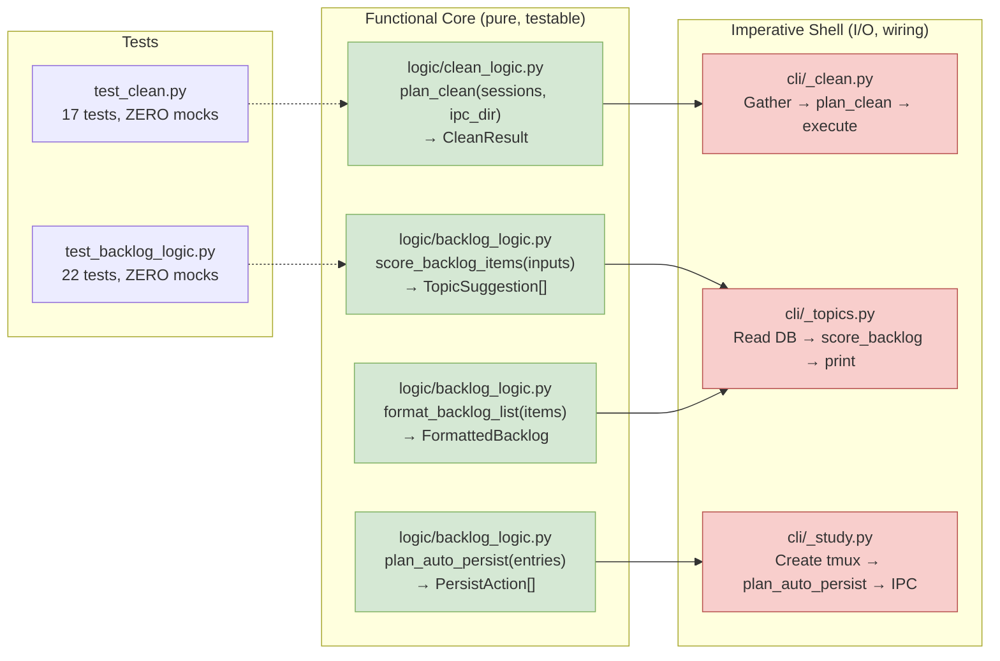

**Why this matters**: `test_clean.py` has 17 tests with zero mocks because `plan_clean()` takes data structures and returns a `CleanResult` — no I/O. This is the gold standard for testability. The same pattern is replicated in `backlog_logic.py` with 22 tests.

**Code example** — the clean logic is 99 lines of pure data transformation:

```python
def plan_clean(
    *,
    tmux_running: bool,
    zombie_sessions: list[str],
    session_dirs: list[DirInfo],
    live_tmux_names: set[str],
    state: dict,
    state_file_exists: bool,
) -> CleanResult:
    """Decide what to clean. Pure logic — no I/O, no side effects."""
    sessions_to_kill: list[str] = []
    dirs_to_remove: list[Path] = []
    warnings: list[str] = []
    state_to_clean = False

    if not tmux_running:
        warnings.append("tmux server not running — skipped session checks")
        return CleanResult(warnings=warnings)

    sessions_to_kill = list(zombie_sessions)
    for d in session_dirs:
        if d.is_symlink:
            warnings.append(f"Skipped symlink: {d.name}")
            continue
        if d.name not in live_tmux_names:
            dirs_to_remove.append(d.path)

    if state_file_exists and state.get("mode") == "ended":
        tmux_name = state.get("tmux_session", "")
        if not tmux_name or tmux_name not in live_tmux_names:
            state_to_clean = True

    return CleanResult(
        sessions_to_kill=sessions_to_kill,
        dirs_to_remove=dirs_to_remove,
        state_to_clean=state_to_clean,
        warnings=warnings,
    )
```

### 2.2 Web Layer — Proper Router Separation

Unlike mailgraph (which has a 676-line monolithic `app.py`), the web layer is properly structured:

```
web/
├── app.py              # 74 lines — factory, middleware, router registration
├── routes/
│   ├── courses.py      # /api/courses
│   ├── cards.py        # /api/cards, /api/review
│   ├── history.py      # /api/history
│   ├── session.py      # /api/session, SSE endpoint
│   └── artefacts.py    # /artefacts
└── static/
    ├── index.html      # Flashcard PWA
    ├── session.html    # Live session dashboard
    └── vendor/         # HTMX, Alpine.js, OpenDyslexic (offline)
```

The `app.py` is 74 lines — a proper factory that registers routers. This is the pattern mailgraph should adopt.

### 2.3 Agent Framework — Shared Definitions

The `agents/shared/` directory eliminates ~700 lines of duplication across 4 platforms:

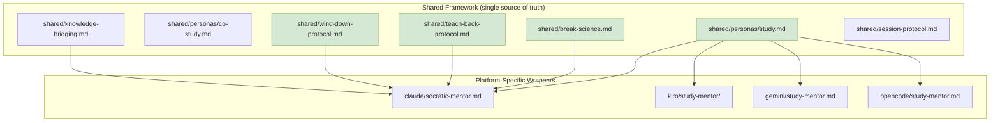

### 2.4 IPC File Protocol — Clean Cross-Process State

The IPC file protocol (`session-state.json`, `session-topics.md`, `session-parking.md`) is a clean solution for sharing state between the tmux agent, sidebar TUI, and web dashboard without requiring a running server:

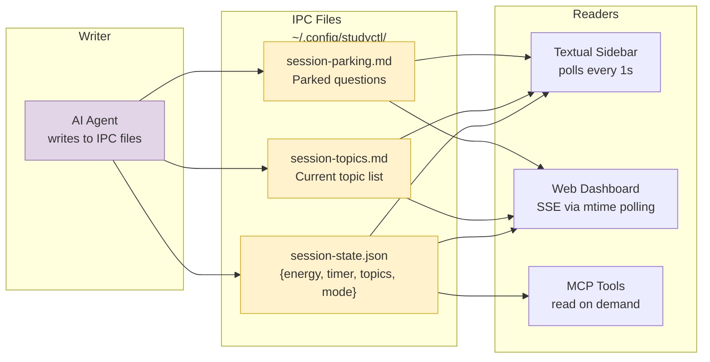

**Tradeoff**: File-based polling instead of a message queue. For a single-user tool, this is the right choice — simpler, no additional process, works offline.

### 2.5 CLI — LazyGroup for Fast Startup

The CLI uses `LazyGroup` to defer imports until commands are invoked:

```python
@click.group(
    cls=LazyGroup,
    lazy_subcommands={
        "study": "studyctl.cli._study:study",
        "clean": "studyctl.cli._clean:clean",
        "doctor": "studyctl.cli._doctor:doctor",
        # ... 20+ more
    },
)
def cli() -> None: ...
```

This means `studyctl --help` starts instantly without importing Textual, FastAPI, or NotebookLM dependencies.

---

## 3. Architectural Issues

### 3.1 `history.py` — 1012-Line God Module

**Problem**: `history.py` is a 1012-line module that does everything: session CRUD, progress tracking, teach-back scoring, knowledge bridges, concept management, energy analysis, medication windows, streak calculation, and migration logic.

```mermaid
flowchart TD
    subgraph "history.py (1012 lines)"
        H1["_get_study_terms()\nFallback keyword list"]
        H2["topic_frequency()\nFTS5 search"]
        H3["struggle_topics()\nKeyword extraction"]
        H4["spaced_repetition_due()\nInterval scheduling"]
        H5["get_last_session_summary()\nAuto-resume context"]
        H6["get_study_streaks()\n90-day streak calc"]
        H7["check_medication_window()\nMeds timing"]
        H8["get_wins()\nConfidence improvements"]
        H9["record_progress()\nUpsert study_progress"]
        H10["record_teachback()\n5-dimension scoring"]
        H11["get_teachback_history()\nScore history"]
        H12["record_bridge()\nKnowledge bridge CRUD"]
        H13["get_bridges()\nBridge queries"]
        H14["update_bridge_usage()\nBridge analytics"]
        H15["start_study_session()\nSession CRUD"]
        H16["end_study_session()\nDuration calc"]
        H17["get_study_session_stats()\nAggregation"]
        H18["get_energy_session_data()\nStreak analysis"]
        H19["migrate_bridges_to_graph()\nOne-time migration"]
        H20["seed_concepts_from_config()\nConfig seeding"]
        H21["list_concepts()\nConcept listing"]
    end

    style H1 fill:#f8cecc,stroke:#b85450
    style H20 fill:#f8cecc,stroke:#b85450
    style H21 fill:#f8cecc,stroke:#b85450
```

**Impact**:
- Hard to navigate — no single-responsibility
- Every function opens/closes its own SQLite connection (no connection pooling)
- Mixes domain concerns: session tracking, progress, teach-back, bridges, concepts
- `_get_study_terms()` has a hardcoded fallback list of 30 keywords

**Recommended structure**:

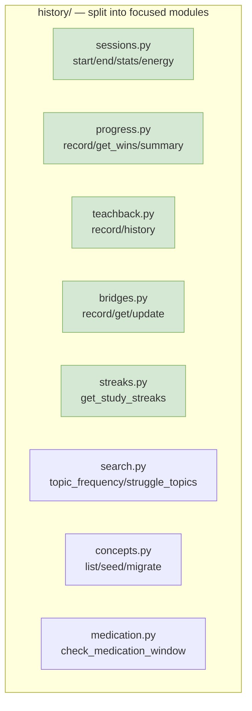

**Estimated effort**: 2-3 days. Each module is ~100-150 lines with clear boundaries.

### 3.2 Two Config Systems — YAML vs JSON in Same Monorepo

**Problem**: `studyctl/settings.py` reads YAML config, while `agent-session-tools/config_loader.py` reads the same YAML file but with a completely different parsing approach and different defaults.

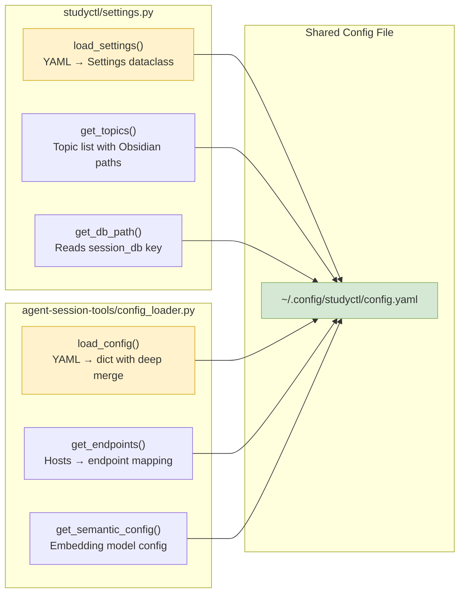

**The good news**: Both packages read the **same** `config.yaml` file. The docstring in `config_loader.py` explains this is intentional:

> Note: Both studyctl and agent-session-tools read the SAME config.yaml file. Each package reads only the sections it needs — studyctl reads topics/content/knowledge_domains; this package reads database/sync/semantic_search. This is intentional: the packages are independently publishable, so they must not import each other's config loaders.

**Assessment**: This is actually a **reasonable design decision** for independently publishable packages. The concern is that the two loaders have different default values and different path resolution logic, which could lead to subtle inconsistencies. The `settings.py` has a `Settings` dataclass with typed fields, while `config_loader.py` returns a raw dict.

**Recommendation**: Keep the separation (it's correct for independent packages), but consider creating a shared `config-schema.yaml` that both packages validate against, ensuring defaults are consistent.

### 3.3 Service Layer — Partially Wired

**Problem**: `services/review.py` exists and is used by `web/routes/cards.py`, but `cli/_review.py` bypasses it and calls `history.py` directly.

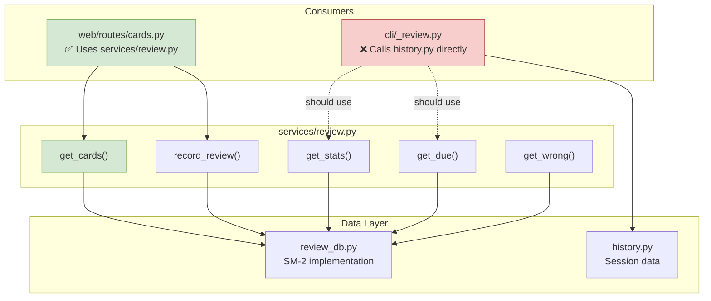

**Impact**: `cli/_review.py` has 346 lines of direct data access and formatting logic. The service layer should be the single point of access for review operations.

**Fix**: Route `cli/_review.py` through `services/review.py` for review-related operations. Note: `cli/_review.py` also handles bridges, streaks, and progress — these are separate concerns that don't belong in the review service.

### 3.4 `_study.py` — 839 Lines of Orchestration

**Problem**: `cli/_study.py` is 839 lines and handles: zombie cleanup, backlog injection, session creation, tmux setup, agent launching, sidebar spawning, resume logic, end logic, cleanup logic, web dashboard spawning, and sidebar CLI entry point.

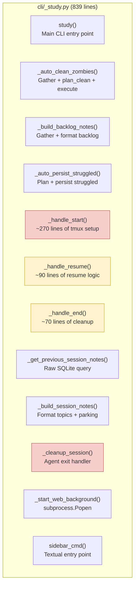

**Assessment**: This is an **imperative shell** — it's supposed to be the wiring layer. At 839 lines, it's doing too much wiring. The `_handle_start()` function alone is ~270 lines.

**Recommended refactoring**:

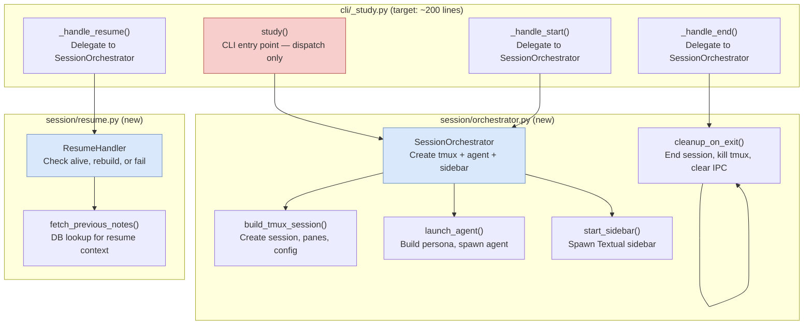

**Estimated effort**: 2-3 days. Extract `SessionOrchestrator` and `ResumeHandler` classes, keep CLI handlers thin.

### 3.5 `_get_previous_session_notes()` — Raw SQLite in CLI

**Problem**: `_study.py:678-693` has a raw SQLite query embedded in a CLI module:

```python
def _get_previous_session_notes(study_id: str | None) -> str | None:
    if not study_id:
        return None
    try:
        import sqlite3
        from studyctl.settings import get_db_path

        conn = sqlite3.connect(str(get_db_path()))
        conn.row_factory = sqlite3.Row
        row = conn.execute(
            "SELECT notes FROM study_sessions WHERE id = ?", (study_id,)
        ).fetchone()
        conn.close()
        return row["notes"] if row and row["notes"] else None
    except Exception:
        return None
```

**Issue**: This duplicates the connection pattern used everywhere else. `history.py` already has `_connect()` and session management functions. This should use `history.py` or a dedicated service function.

**Fix**: Add `get_session_notes(study_id)` to `history.py` or a session service.

### 3.6 `_cleanup_session()` vs `_handle_end()` — Duplicate Logic

**Problem**: `_cleanup_session()` (line 726) and `_handle_end()` (line 610) do nearly the same thing:
- Parse topics and parking files
- Build session notes
- End study session in DB
- Write `mode=ended` to state
- Clean up persona file
- Kill tmux sessions
- Clear IPC files

The only differences:
- `_cleanup_session()` runs inside the tmux session (fire-and-forget, `contextlib.suppress(Exception)`)
- `_handle_end()` runs from the CLI (user-facing output, explicit error handling)

**Recommendation**: Extract a shared `_end_session_common()` function that both call, with different output handling.

### 3.7 `settings.py` — Dual Purpose Module

**Problem**: `settings.py` (367 lines) does two things:
1. Configuration loading (`load_settings()`, `Settings` dataclass)
2. Topic management (`get_topics()`, `Topic` dataclass, hardcoded defaults)

The hardcoded defaults in `get_topics()` include your personal Obsidian paths:

```python
obsidian_courses = obsidian_base / "Personal" / "2-Areas" / "Study" / "Courses"
obsidian_mentoring = obsidian_base / "Personal" / "2-Areas" / "Study" / "Mentoring"
```

**Impact**: The module mixes configuration infrastructure with domain-specific topic definitions. The hardcoded paths are personal and won't work for other users.

**Recommendation**: Split into `settings.py` (config loading) and `topics.py` (topic definitions). The default topics should be empty — users configure their own via `config.yaml`.

### 3.8 Two SQLite Databases — sessions.db + review.db

**Problem**: Two separate SQLite databases with no cross-database queries.

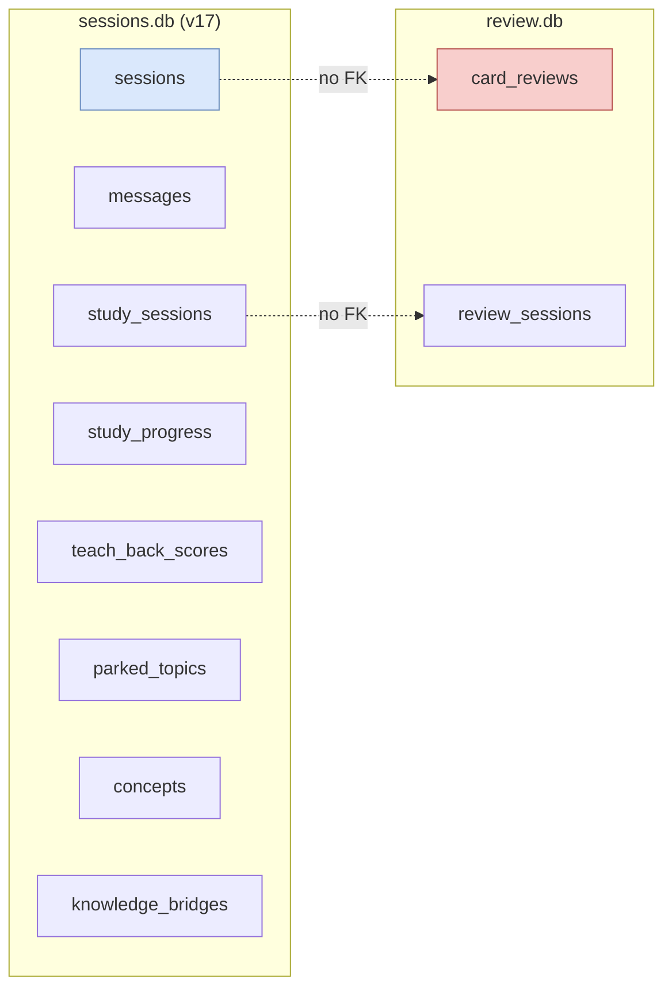

**Tradeoff analysis**:
- **Pro**: Separation of concerns — session tracking vs spaced repetition are independent lifecycles
- **Pro**: `review.db` can be synced independently via `session-sync`
- **Con**: Can't query "show flashcards for topics I struggled with in sessions"
- **Con**: Two database connections to manage

**Recommendation**: Keep separate. The separation is intentional and correct for independently publishable packages. If cross-database queries become needed, use SQLite's `ATTACH DATABASE`.

### 3.9 Test Harness — UAT Tests Excluded from CI

**Problem**: The UAT tests require tmux and are excluded from CI:

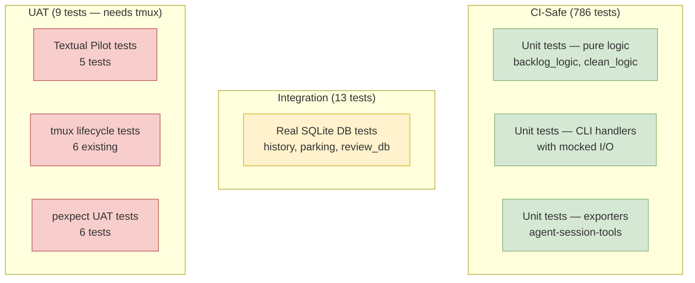

**Concern**: tmux-related regressions won't be caught automatically in CI.

**Recommendation**: Add a nightly CI job on macOS runner with tmux installed.

---

## 4. Code Quality Observations

### 4.1 Strengths

| Strength | Evidence | Impact |
|----------|----------|--------|
| **FCIS pattern** | `clean_logic.py` (99 lines), `backlog_logic.py` (223 lines) — pure functions, zero mocks | Gold standard testability |
| **Test pyramid** | 786 CI-safe, 13 integration, 9 UAT | Fast CI, thorough coverage |
| **Agent framework** | `agents/shared/` eliminated ~700 lines | Single source of truth |
| **Web router separation** | `web/app.py` is 74 lines, 5 route modules | Clean, maintainable |
| **IPC file protocol** | 3 files, no running server required | Simple, offline-capable |
| **Doctor package** | 19 health checks, 7 categories, `--json` output | Self-diagnosing |
| **LazyGroup CLI** | 20+ subcommands, instant startup | Good UX |
| **Migration system** | v0 to v17 with proper versioning | Safe schema evolution |
| **Distribution** | PyPI + Homebrew tap | Professional |
| **Security headers** | `SecurityHeadersMiddleware` on all responses | X-Content-Type, X-Frame, X-XSS |
| **Compaction discipline** | Roadmap shows clear focus after stripping bloat | YAGNI in practice |

### 4.2 Concerns

| Concern | Severity | Location | Description |
|---------|----------|----------|-------------|
| `history.py` god module | **High** | `history.py` (1012 lines) | 21 functions, mixes 7 domain concerns |
| `_study.py` orchestration bloat | **High** | `cli/_study.py` (839 lines) | `_handle_start()` is ~270 lines |
| Raw SQLite in CLI | **Medium** | `_study.py:678` | Duplicates connection pattern |
| Duplicate end/cleanup logic | **Medium** | `_handle_end()` vs `_cleanup_session()` | ~80% code overlap |
| Service layer incomplete | **Medium** | `services/review.py` | `cli/_review.py` bypasses it |
| `settings.py` dual purpose | **Medium** | `settings.py` (367 lines) | Config loading + topic definitions mixed |
| Two config systems | **Low** | `settings.py` vs `config_loader.py` | Different defaults, same file (intentional) |
| UAT tests excluded from CI | **Medium** | `test_tmux.py`, `test_uat_terminal.py` | tmux regressions not caught |
| Hardcoded personal paths | **Low** | `settings.py:get_topics()` | Personal Obsidian paths in defaults |

---

## 5. Data Flow — Session Lifecycle

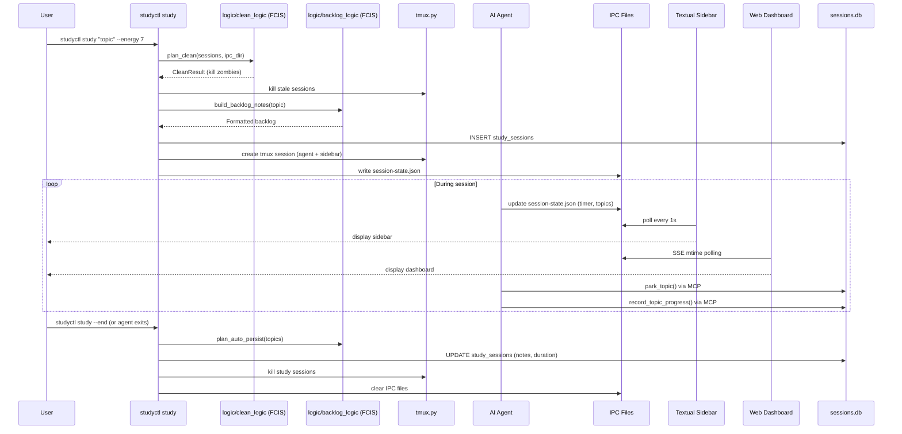

---

## 6. Package Boundaries

### 6.1 studyctl vs agent-session-tools

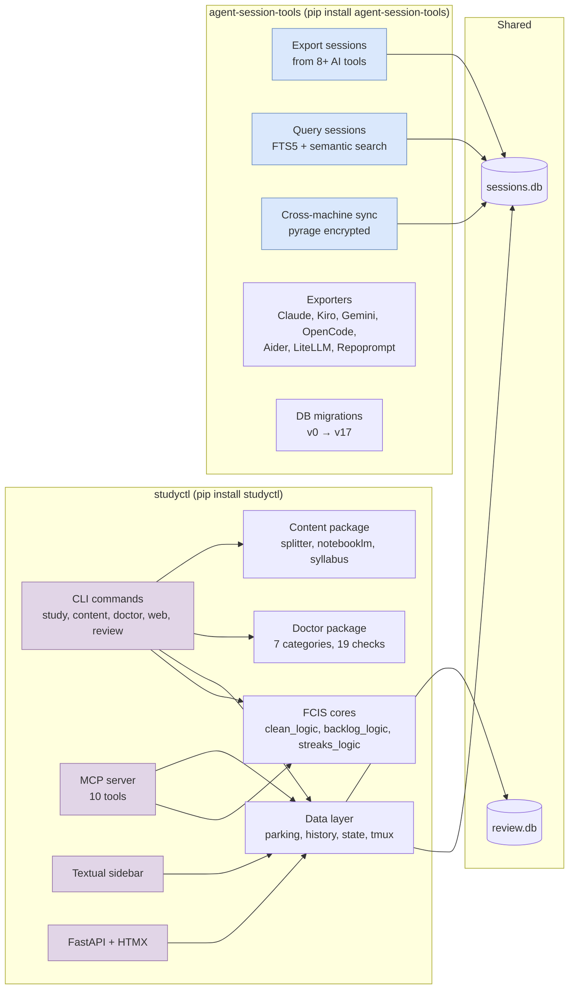

**Boundary assessment**: Clean. `studyctl` handles the study experience, `agent-session-tools` handles session export/search/sync. They share the same SQLite database but have independent publishable lifecycles.

### 6.2 Dependency Flow

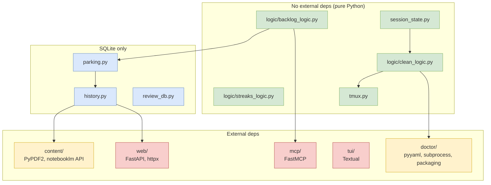

**Assessment**: Dependency flow is mostly clean. The FCIS cores have zero external dependencies, which is excellent. The web and TUI layers are the heaviest (as expected).

---

## 7. Documentation Health

| Document | Status | Accuracy | Action |
|----------|--------|----------|--------|
| `docs/architecture/system-overview.md` | Current | High | Keep updating |
| `docs/roadmap.md` | Current | High | Keep updating |
| `docs/setup-guide.md` | Current | High | Keep updating |
| `docs/session-protocol.md` | Current | High | Keep updating |
| `docs/TESTING.md` | Current | High | Keep updating |
| `docs/cli-reference.md` | Current | High | Keep updating |
| `docs/mentoring/functional-core-imperative-shell.md` | Current | High | Excellent reference |
| `docs/architecture/study-backlog-phase1.md` | Historical | Medium | Mark as completed |
| `docs/architecture/study-backlog-phase2.md` | Historical | Medium | Mark as completed |
| `docs/reviews/2026-04-03-architecture-review.md` | Current | High | This review supersedes |

**Recommendation**: Add a `docs/HISTORICAL.md` index that clearly marks which documents are historical vs current.

---

## 8. Recommendations — Priority Order

### P0: Split `history.py` God Module

**Why**: 1012 lines, 21 functions, 7 domain concerns mixed together. This is the single biggest maintainability issue in the codebase.

**Steps**:
1. Create `studyctl/history/` package
2. Split into: `sessions.py`, `progress.py`, `teachback.py`, `bridges.py`, `streaks.py`, `search.py`, `concepts.py`, `medication.py`
3. Create `studyctl/history/__init__.py` re-exporting all public functions
4. Run full test suite to verify

**Estimated effort**: 2-3 days

### P0: Extract `SessionOrchestrator` from `_study.py`

**Why**: 839 lines of orchestration logic. `_handle_start()` is ~270 lines.

**Steps**:
1. Create `studyctl/session/orchestrator.py` with `SessionOrchestrator` class
2. Move tmux creation, agent launching, sidebar spawning into orchestrator
3. Create `studyctl/session/resume.py` with `ResumeHandler` class
4. Extract shared `_end_session_common()` from `_handle_end()` and `_cleanup_session()`
5. Keep `cli/_study.py` as thin CLI handlers (~200 lines)

**Estimated effort**: 2-3 days

### P1: Wire Service Layer Completely

**Why**: `services/review.py` exists but `cli/_review.py` bypasses it.

**Steps**:
1. Move review-related functions from `history.py` into `services/review.py`
2. Update `cli/_review.py` to import from `services/review.py`
3. Add tests for `services/review.py` (currently missing)

**Estimated effort**: 1 day

### P1: Add Nightly CI for UAT Tests

**Why**: tmux-related regressions not caught in CI.

**Steps**:
1. Add GitHub Actions workflow: `nightly-uat.yml`
2. Run on macOS runner with tmux installed
3. Execute `pytest -m integration` only
4. Notify on failure

**Estimated effort**: 0.5 days

### P1: Split `settings.py` Dual Purpose

**Why**: Config loading + topic definitions mixed in one module.

**Steps**:
1. Create `studyctl/topics.py` for topic definitions
2. Move `get_topics()`, `Topic` dataclass to `topics.py`
3. Remove hardcoded personal Obsidian paths from defaults
4. Keep `settings.py` for config loading only

**Estimated effort**: 0.5 days

### P2: Fix VSCode Circular Import

**Why**: Known issue blocking VSCode integration.

**Steps**:
1. Analyze import cycle in `integrations/vscode.py`
2. Break cycle with lazy import or restructure
3. Add test

**Estimated effort**: 0.5 days

### P2: Unify Config Defaults

**Why**: Two config loaders have different defaults for the same config file.

**Steps**:
1. Create `config-schema.yaml` with all defaults
2. Both `settings.py` and `config_loader.py` validate against it
3. Ensure path resolution is consistent

**Estimated effort**: 1 day

---

## 9. Comparison with mailgraph

| Dimension | mailgraph | socratic-study-mentor | Winner |
|-----------|-----------|----------------------|--------|
| **Layer boundaries** | Violated (query→api) | Clean (FCIS pattern) | **study-mentor** |
| **Route organization** | Monolith (676 lines) | Proper routers (74 lines) | **study-mentor** |
| **Test strategy** | 407 tests, missing API/E2E | 799+ tests, 3 tiers | **study-mentor** |
| **FCIS pattern** | Not used | Consistently applied | **study-mentor** |
| **Service layer** | Incomplete migration | Partially wired | **Tie** |
| **Documentation** | Exceptional | Exceptional | **Tie** |
| **Distribution** | uv tool install only | PyPI + Homebrew | **study-mentor** |
| **Config management** | Single TOML | Two systems (intentional) | **mailgraph** |
| **Multi-database** | SQLite + PG + Neo4j | SQLite + SQLite | **mailgraph** (more capable) |
| **Agent support** | MCP server only | 4 platforms + shared framework | **study-mentor** |
| **God modules** | `api/app.py` (676 lines) | `history.py` (1012 lines), `_study.py` (839 lines) | **Tie** (both have them) |

---

## 10. Summary Scorecard

| Dimension | Score | Notes |
|-----------|-------|-------|
| **Functionality** | 9/10 | 4 core features working, v2.2 polish pending |
| **Architecture** | 8/10 | FCIS pattern, clean package boundaries, proper routers |
| **Code Quality** | 7/10 | Pure functions, zero-mock tests, but `history.py` and `_study.py` are too large |
| **Test Coverage** | 9/10 | 799+ tests, 3 tiers, but UAT excluded from CI |
| **Documentation** | 9/10 | Exceptional, well-organized, some historical docs |
| **Performance** | 8/10 | SSE via mtime polling (acceptable), no major bottlenecks |
| **Security** | 8/10 | Security headers, proper file permissions (0700/0600) |
| **Maintainability** | 7/10 | FCIS pattern makes changes easy, but `history.py` and `_study.py` are bottlenecks |

**Overall: 8.1/10** — A well-architected, mature project with strong foundations. The FCIS pattern is exemplary. The main areas for improvement are splitting the two god modules (`history.py` at 1012 lines and `_study.py` at 839 lines) and wiring the service layer completely.

---

## 11. Key Takeaway

The **FCIS (Functional Core, Imperative Shell) pattern** is the standout architectural decision. It produces:
- **Zero-mock tests** — pure functions that take data and return data
- **Easy reasoning** — no side effects to track
- **Composable logic** — functions can be combined without I/O concerns

This pattern should be extended to cover the remaining large modules. `history.py` (1012 lines) should be split into focused FCIS cores, and `_study.py` (839 lines) should delegate to an orchestrator class.

The contrast with mailgraph is instructive: mailgraph has layer violations and a monolithic `app.py`, while study-mentor has clean boundaries, proper routers, and testable cores. Both projects have god modules that need splitting, but study-mentor's are easier to refactor because the FCIS pattern is already established.
