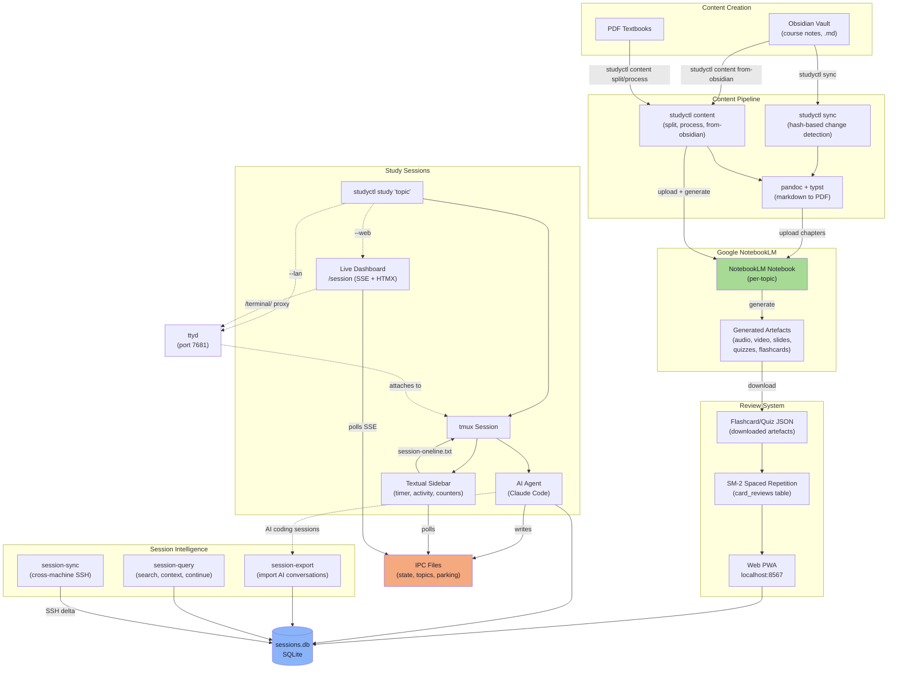
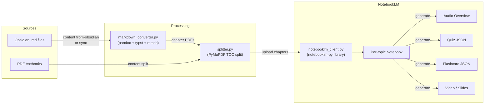
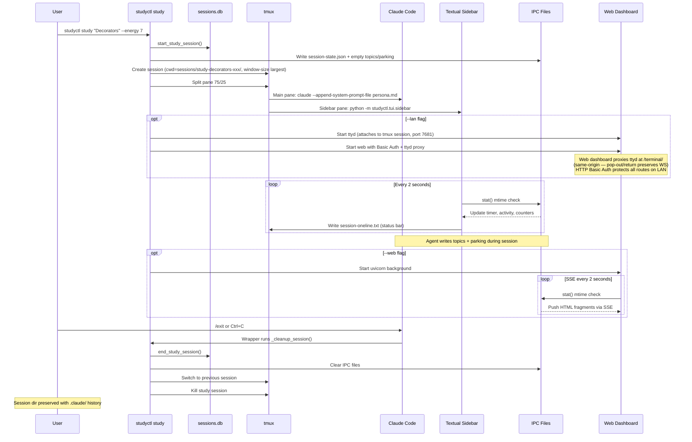
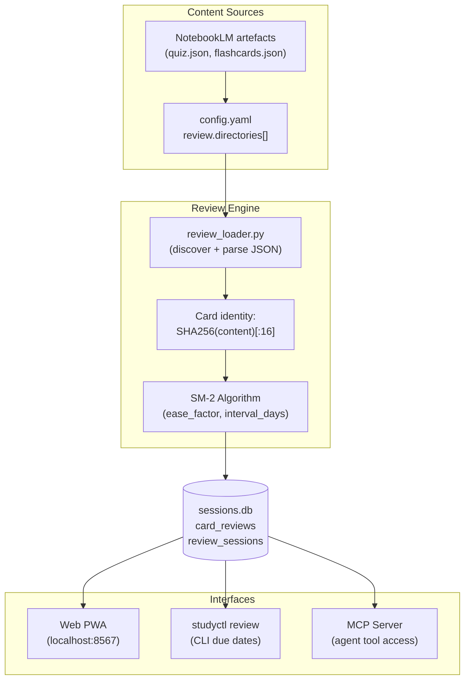
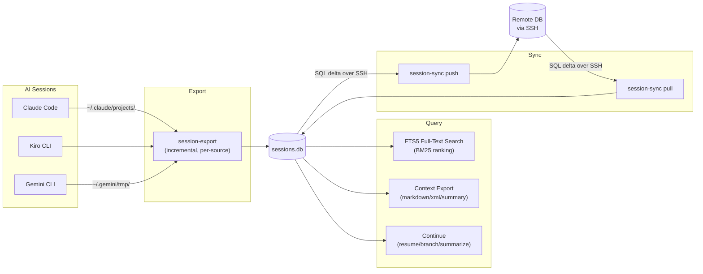
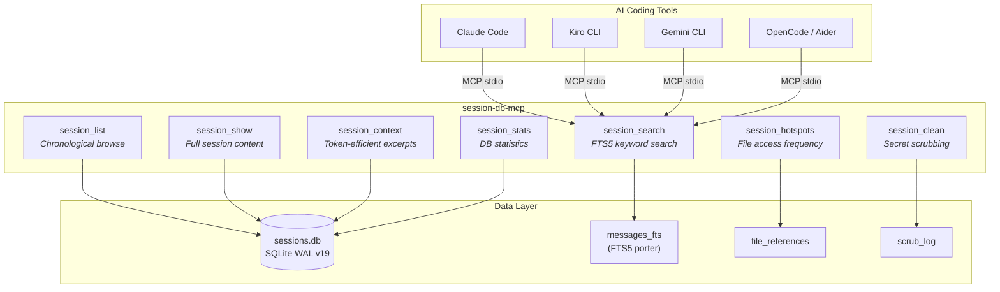
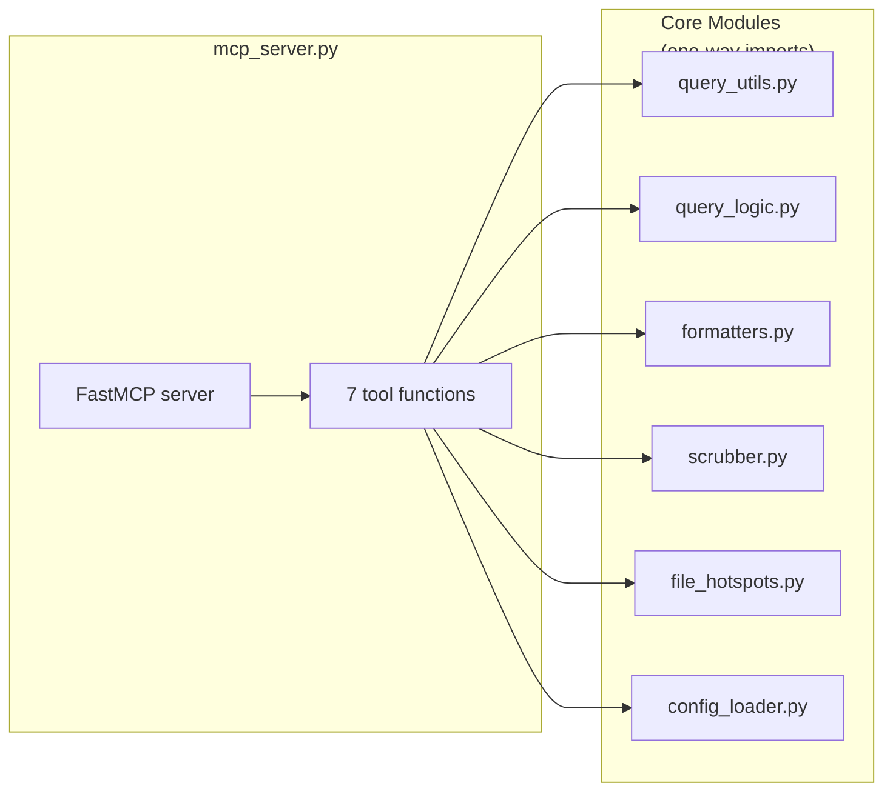
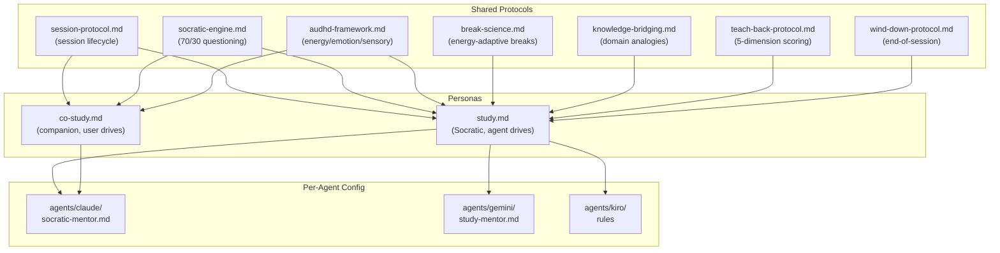
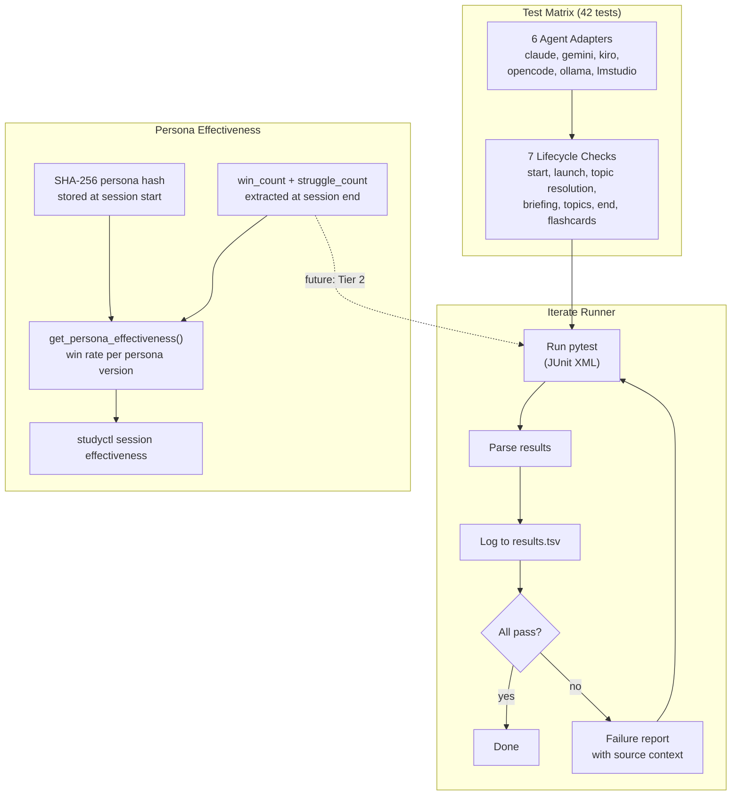

# System Overview — How Everything Connects

> A complete map of the studyctl ecosystem: from Obsidian notes to AI study sessions to spaced repetition.

---

## The Big Picture



---

## Component Deep-Dives

### 1. Content Pipeline — From Notes to NotebookLM

The content pipeline turns your study materials into AI-generated learning artefacts.



**Two paths to NotebookLM:**

| Command | What it does | When to use |
|---------|-------------|-------------|
| `studyctl sync TOPIC` | Hash-based change detection, syncs only modified files. Converts .md to PDF via pandoc. | Ongoing sync as you take notes |
| `studyctl content from-obsidian DIR` | Full pipeline: markdown to PDF, split by chapter, upload, generate artefacts, download | First-time processing of a course |
| `studyctl content process PDF` | Split PDF by TOC, upload chapters, generate artefacts | Processing a textbook |
| `studyctl content split PDF` | Just split a PDF by chapter bookmarks | Prep step before manual upload |

**NotebookLM gotchas:**
- Generation takes 15+ minutes for slides/video (timeout must be >= 900s)
- Daily quota ~20-25 for infographics/slides (Pro tier)
- Sequential generation with 30s gap between types to avoid rate limits

---

### 2. Study Sessions — One Command, Full Environment



**Session directory structure:**
```
~/.config/studyctl/sessions/
  study-python-decorators-abc12345/
    .claude/          # Claude conversation history (preserved!)
  study-spark-internals-xyz98765/
    .claude/          # Separate conversation
```

**Resume flow:**
```bash
# tmux still alive → reattach
studyctl study --resume

# tmux dead, session dir preserved → rebuild + claude -r
studyctl study --resume
# Claude: "Last time we covered closures, you were about to..."
```

---

### 3. Review System — Spaced Repetition



**Web PWA features:**
- Flashcard flip (Space), answer (Y/N), read aloud (T)
- Source/chapter filter, card count limiter
- 90-day study heatmap
- Pomodoro timer with audio chime
- OpenDyslexic font toggle, dark/light theme
- Installable as PWA on phone/tablet

---

### 4. Session Intelligence — Cross-Session Learning



**Key commands:**
```bash
session-export                          # Import all AI sessions
session-query search "decorators"       # Full-text search
session-query context SESSION_ID        # Export for LLM consumption
session-query continue SESSION_ID       # Resume context
session-sync push mac-mini              # Push to remote
session-sync pull mac-mini              # Pull from remote
```

#### session-db-mcp — MCP Server for Session Access

A standalone MCP server exposing the session database to any MCP-compatible AI tool via stdio transport. Installed as part of `agent-session-tools`.



**Tool reference:**

| Tool | Type | Description |
|------|------|-------------|
| `session_search` | read-only | FTS5 keyword search with porter stemming. Supports AND/OR/NOT. Filter by `source`, `project` |
| `session_list` | read-only | List sessions chronologically with pagination. Filter by `source`, `project` |
| `session_show` | read-only | Full session with all messages. Supports partial ID prefix matching |
| `session_context` | read-only | Token-efficient excerpts: `compressed` (~35%), `summary` (~20%), `context_only` (~25%), `markdown`, `xml`. Respects `max_tokens` budget |
| `session_stats` | read-only | Total sessions/messages, sources breakdown, date range, storage size |
| `session_clean` | destructive | Scrub secrets (API keys, tokens, credentials) with format-preserving placeholders. `dry_run=True` default; audit trail in `scrub_log` |
| `session_hotspots` | read-only | Most-discussed files ranked by reference count. Filter by `project`, `days` |

**Architecture:**



**Registration:**
```json
{
  "mcpServers": {
    "session-db": {
      "command": "session-db-mcp"
    }
  }
}
```

**Usage examples:**
```python
# Search past work
session_search(query="JWT middleware", source="claude_code", limit=5)

# Token-efficient context for reuse
session_context(session_id="sess-auth", format="compressed", max_tokens=2000)

# Most-discussed files this week
session_hotspots(days=7, limit=10)

# Audit secrets before sharing
session_clean(session_id="sess-abc123", dry_run=True)
```

---

### 5. Agent Protocol — How AI Mentors Behave



---

### 6. Autoresearch Harness — Self-Improving Quality Loop

Inspired by [karpathy/autoresearch](https://github.com/karpathy/autoresearch): define a metric, iterate autonomously, keep improvements, discard regressions. Applied to both **code correctness** and **teaching effectiveness**.



**What it tracks:**

| Metric | Source | Purpose |
|--------|--------|---------|
| Test pass/fail per agent | `results.tsv` (iterate runner) | Code correctness over time |
| Persona hash | `study_sessions.persona_hash` | Links persona version to outcomes |
| Win count | `study_sessions.win_count` | Structured outcome (was text-only) |
| Struggle count | `study_sessions.struggle_count` | Structured outcome (was text-only) |
| Win rate | `win_count / (win_count + struggle_count)` | Teaching effectiveness per persona |

**Usage:**

```bash
# Run the test matrix
uv run python scripts/test_iterate.py --no-git-check

# View iteration history
uv run python scripts/test_iterate.py --progress

# View persona effectiveness
studyctl session effectiveness
```

**Future (Tier 2):** The iterate runner can target persona templates instead of code — run simulated study sessions against fixed scenarios, measure teaching quality, keep/discard persona changes via git. The infrastructure is ready; the evaluation harness is the next step.

---

## Data Stores

| Store | Location | What's in it |
|-------|----------|-------------|
| `sessions.db` | `~/.config/studyctl/sessions.db` | Study sessions, card reviews, progress tracking, teach-back scores, knowledge bridges, concepts |
| `config.yaml` | `~/.config/studyctl/config.yaml` | Topics, Obsidian paths, notebook IDs, medication timing, knowledge domains |
| `state.json` | `~/.local/share/studyctl/state.json` | Sync state (per-file hashes, last sync timestamps) |
| Session dirs | `~/.config/studyctl/sessions/` | Per-session `.claude/` conversation history |
| IPC files | `~/.config/studyctl/session-*.{json,md}` | Live session state (transient, cleared on end) |
| Artefacts | Alongside source PDFs | Downloaded NotebookLM audio/video/quiz/flashcard files |

---

## End-to-End Workflow Example

Here's a complete workflow from course materials to mastery:

```
1. PREPARE MATERIALS
   ─────────────────
   Take notes in Obsidian → studyctl content from-obsidian ./notes/
   OR: Have a PDF textbook → studyctl content process textbook.pdf

   Result: chapters uploaded to NotebookLM, artefacts generated

2. REVIEW ARTEFACTS
   ─────────────────
   Listen to NotebookLM audio overviews (podcast-style)
   Download quiz + flashcard JSON to review directory

3. STUDY WITH AI MENTOR
   ─────────────────────
   studyctl study "Python Decorators" --energy 7

   → tmux opens with Claude as Socratic mentor
   → Sidebar shows timer, activity, counters
   → Agent asks questions, tracks wins/struggles
   → Park tangential topics for later
   → Quit Claude when done (auto-cleanup)

4. REVIEW FLASHCARDS
   ──────────────────
   studyctl web → open localhost:8567

   → SM-2 surfaces due cards
   → Review on phone/tablet (PWA)
   → Track accuracy over time

5. TRACK PROGRESS
   ───────────────
   studyctl streaks        → study consistency
   studyctl wins           → mastered concepts
   studyctl struggles      → recurring trouble spots
   studyctl resume         → last session context

6. SYNC ACROSS MACHINES
   ─────────────────────
   session-sync push mac-mini   → push session history
   session-sync pull laptop     → pull on another machine

7. RESUME NEXT DAY
   ────────────────
   studyctl study --resume

   → Claude picks up conversation: "Last time we covered..."
```

---

## Prerequisites

| Component | Required | Install |
|-----------|----------|---------|
| Python 3.12+ | Yes | `mise install python` or system package |
| tmux 3.1+ | For `studyctl study` | `brew install tmux` / `apt install tmux` |
| ttyd | Optional — remote terminal (`--lan`) | `brew install ttyd` / `apt install ttyd` |
| Claude Code | For AI study sessions | `npm install -g @anthropic-ai/claude-code` |
| pandoc | For markdown to PDF | `brew install pandoc` |
| typst | For PDF rendering | `brew install typst` |
| PyMuPDF | For PDF splitting | `pip install 'studyctl[content]'` |
| notebooklm-py | For NotebookLM API | `pip install 'studyctl[notebooklm]'` |
| Textual | For TUI sidebar | `pip install 'studyctl[tui]'` |
| FastAPI + uvicorn | For web UI | `pip install 'studyctl[web]'` |

```bash
# Install everything
pip install 'studyctl[all]'

# Or just what you need
pip install studyctl                    # CLI + review only
pip install 'studyctl[tui,web]'        # + sidebar + web dashboard
pip install 'studyctl[content]'        # + PDF pipeline
```
