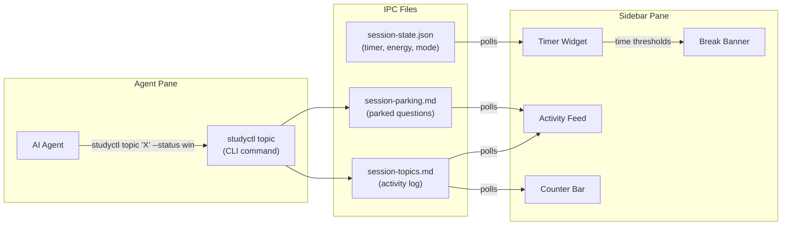

# TUI Sidebar Guide

> The Textual sidebar runs alongside your AI agent in a split tmux layout, showing live session progress without leaving the terminal.

---

## Layout

When you start a study session with `studyctl study "topic"`, a tmux session is created with two panes:

```
+------------------------------------------+------------------+
|                                          |                  |
|         AI Agent (main pane)             |    Sidebar       |
|                                          |                  |
|   Your AI mentor runs here.              |   00:12:34       |
|   Claude Code, Gemini, Kiro,             |   ELAPSED        |
|   OpenCode, Ollama, or LM Studio.        |                  |
|                                          |  ── Activity ──  |
|   The agent has full terminal access     |  * Closures  win |
|   and uses Socratic questioning to       |  * Decorators    |
|   guide your learning.                   |    learning      |
|                                          |  o Metaclasses   |
|                                          |    parked        |
|                                          |                  |
|                                          |  WINS:2 PARK:1   |
|                                          |                  |
|                                          |  p:pause r:reset |
|                                          |  Q:end session   |
+------------------------------------------+------------------+
           ~75% width                          ~25% width
```

The sidebar occupies the right 25% of the terminal. The agent gets the remaining 75%.

---

## Data Flow

The sidebar reads from IPC files that the agent writes to during the session:



The sidebar polls these files every second. When the agent logs a topic via `studyctl topic`, the sidebar updates within 1-2 seconds.

---

## Widgets

### Timer

The timer shows elapsed time or Pomodoro cycles depending on the session mode.

**Elapsed mode** (default for `--mode study`):

The timer counts up from 00:00:00, changing colour as time passes:

| Phase | Time | Colour | Meaning |
|-------|------|--------|---------|
| Fresh | 0-25 min | Green | Deep work zone |
| Sustained | 25-50 min | Amber | Consider a break soon |
| Extended | 50+ min | Red | Break recommended |

**Pomodoro mode** (default for `--mode co-study`):

Alternates between 25-minute work periods and 5-minute breaks, with a 15-minute break every 4 cycles. The timer counts down and chimes at transitions.

Switch modes explicitly:

```bash
studyctl study "Python" --timer pomodoro    # Force Pomodoro in study mode
studyctl study "Python" --timer elapsed     # Force elapsed in co-study mode
```

### Activity Feed

Shows topics logged during the session with status icons:

| Icon | Status | Meaning |
|------|--------|---------|
| `*` (check) | `win` | Concept mastered |
| `*` (star) | `insight` | Aha moment or bridge connection |
| `*` (diamond) | `learning` | Currently exploring |
| `^` (triangle) | `struggling` | Needs different explanation |
| `o` (circle) | `parked` | Tangent saved for later |

Each entry shows the topic name, status, and the note the agent recorded.

### Counter Bar

Running totals at the bottom of the sidebar:

```
WINS: 3  |  PARKED: 1  |  REVIEW: 2
```

- **WINS** — topics with status `win` or `insight` (green)
- **PARKED** — questions deferred to the parking lot
- **REVIEW** — topics with status `struggling` (flagged for next session)

### Break Banner

Appears automatically based on elapsed time and energy level. The sidebar uses energy-adaptive thresholds:

| Energy Level | Micro Break | Short Break | Long Break |
|--------------|-------------|-------------|------------|
| Low (1-3) | 15 min | 30 min | 60 min |
| Medium (4-7) | 20 min | 45 min | 90 min |
| High (8-10) | 25 min | 50 min | 120 min |

The banner is colour-coded (blue for micro, amber for short, red for long) and auto-dismisses when the timer is paused.

---

## Key Bindings

Press these keys while the sidebar pane is focused (click the sidebar or use `Ctrl-b →` in tmux to switch):

| Key | Action | Description |
|-----|--------|-------------|
| `p` | Toggle pause | Pauses/resumes the timer. Resuming records a break taken. |
| `r` | Reset timer | Resets the timer to 00:00:00. |
| `Q` | End session | Ends the entire study session: sends `/exit` to the agent, runs cleanup (flashcard generation, DB update), kills the tmux session. |
| `q` | Quit sidebar | Quits only the sidebar process. The tmux session and agent continue running. |

**Important**: `Q` (uppercase) ends everything. `q` (lowercase) only quits the sidebar widget.

---

## Starting a Session

```bash
# Basic session
studyctl study "Python Decorators" --energy 7

# With web dashboard alongside the TUI
studyctl study "Python Decorators" --energy 7 --web

# Co-study mode (Pomodoro timer, agent is passive)
studyctl study "Python Decorators" --mode co-study

# Choose a specific AI agent
studyctl study "Python Decorators" --agent gemini
```

You'll be dropped into the tmux session automatically. The agent starts in the left pane, the sidebar in the right.

## Ending a Session

Three ways to end:

1. **Press `Q` in the sidebar** — cleanest method, runs full cleanup
2. **Type `studyctl study --end`** in a separate terminal
3. **Quit the agent** (e.g. type `/exit` in Claude Code) — the wrapper script triggers cleanup automatically

All three paths run the same cleanup: flashcard generation from session wins, DB session end, tmux session kill, IPC file removal.

---

## Resuming a Session

If your terminal disconnects or you close the window:

```bash
studyctl study --resume
```

This reattaches to the existing tmux session with your agent conversation and sidebar state intact.
