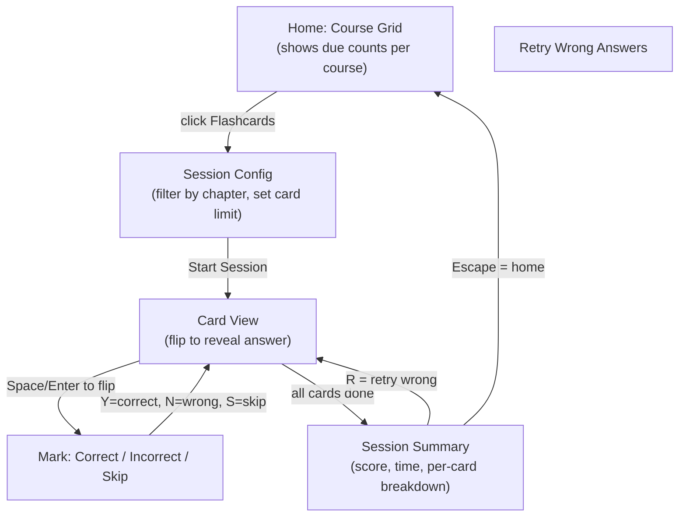
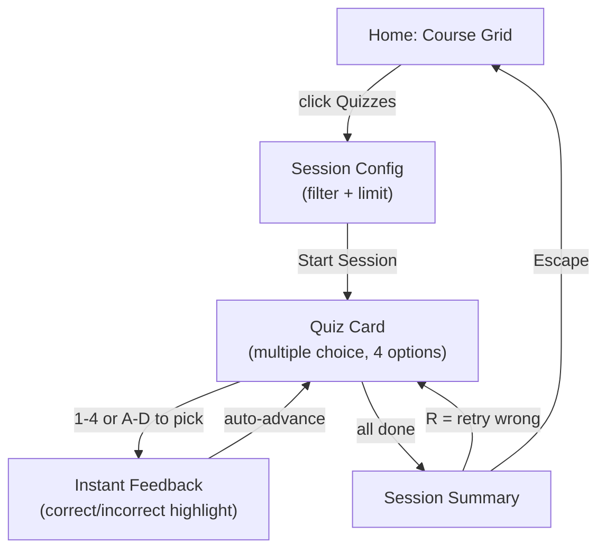
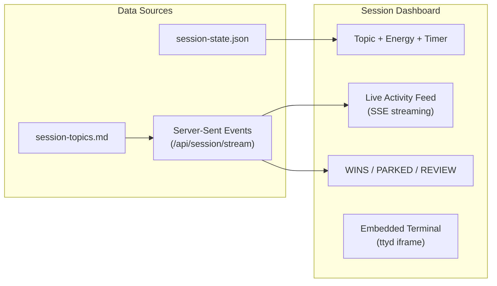

# Web UI Guide

> The studyctl web interface serves two purposes: a spaced repetition review app (flashcards + quizzes) and a live study session dashboard with embedded terminal.

---

## Starting the Web UI

```bash
studyctl web                        # localhost:8567
studyctl web --lan                  # LAN-accessible with auto-generated password
studyctl web --lan --password SECRET  # LAN with explicit password
studyctl web -p 9000                # custom port
```

Open your browser to `http://localhost:8567`. The PWA is installable — add it to your home screen on mobile for offline review.

---

## Flashcard Review



### Walkthrough

1. **Home screen** — shows all courses as cards with due-count badges. A 90-day activity heatmap shows your study consistency. Courses with cards due today are highlighted.

2. **Pick a course** — click the **Flashcards** button on a course card. If the course has multiple chapters, you'll see a filter dropdown to select specific chapters and a card limit picker.

3. **Study cards** — each card shows the front (question). Press **Space** or **Enter** to flip and reveal the answer.

4. **Mark your answer**:
   - **Y** or click the green button — Correct (SM-2 interval increases)
   - **N** or click the red button — Incorrect (interval resets to 1 day)
   - **S** or click Skip — skip this card (no SM-2 update)

5. **Session summary** — shows your score (correct/incorrect/skipped), total time, and a per-card breakdown. Press **R** to retry only the cards you got wrong.

6. **Return home** — press **Escape** at any time.

### Keyboard Shortcuts (Flashcard Mode)

| Key | Action |
|-----|--------|
| Space / Enter | Flip card |
| Y | Mark correct |
| N | Mark incorrect |
| S | Skip card |
| T | Read card aloud (text-to-speech) |
| V | Toggle auto-voice (reads every card) |
| Escape | Return to home |

---

## Quiz Mode



### Walkthrough

1. **Pick a course** — click the **Quizzes** button on a course card.

2. **Answer questions** — each card shows a question with 4 multiple-choice options. Press **1-4** or **A-D** to select your answer. Correct answers highlight green; wrong answers highlight red with the correct answer shown.

3. **Summary** — same as flashcard mode. Press **R** to retry wrong answers.

### Keyboard Shortcuts (Quiz Mode)

| Key | Action |
|-----|--------|
| 1-4 or A-D | Select answer option |
| T | Read question aloud |
| V | Toggle auto-voice |
| Escape | Return to home |

---

## Live Session Dashboard

When you start a study session with `--web`, the dashboard provides a real-time view of your session from any device:

```bash
studyctl study "Python Decorators" --energy 7 --web
```

### Accessing the Dashboard

- **Local**: `http://localhost:8567/session`
- **LAN** (with `--lan`): `http://<your-ip>:8567/session` (password-protected)

The LAN URL and password are printed to the terminal at session start.



### Dashboard Sections

**Header** — shows the study topic, energy level (as a `/10` badge), and a live timer matching the sidebar.

**Activity Feed** — real-time stream of topics as the agent logs them. Updates via SSE (Server-Sent Events) with no page refresh needed. Each entry shows the topic name, status icon, and note.

**Counter Bar** — WINS, PARKED, and REVIEW counts updated live.

**Embedded Terminal** — the ttyd terminal panel shows your tmux session, letting you interact with the agent from the browser. See the Terminal section below.

---

## Terminal (ttyd)

The web dashboard embeds a terminal via [ttyd](https://github.com/nickolasgaddis/ttyd), giving you full terminal access to the study session from a browser.

### How it works

ttyd runs as a background process alongside the web server. The dashboard embeds it in an iframe at `/terminal/`, proxied through FastAPI on the same port (no CORS issues).

### Pop-out and return

- **Pop-out** — click the pop-out button to open the terminal in a separate browser window. Useful on multi-monitor setups.
- **Return** — close the pop-out window or click "Show terminal" on the dashboard to re-embed the iframe.

The terminal stays connected during pop-out/return — your tmux session is not interrupted.

### LAN access

With `--lan`, the terminal is accessible from other devices on your network:

```bash
studyctl study "topic" --web --lan --password mypassword
```

Access from a tablet or phone at `http://<host-ip>:8567/session`. HTTP Basic Auth protects the connection.

### Without ttyd

If ttyd is not installed, the dashboard works without the terminal panel. The activity feed, timer, and counters still function. Install ttyd with:

```bash
brew install ttyd      # macOS
apt install ttyd       # Debian/Ubuntu
```

---

## Accessibility

### OpenDyslexic Font

Toggle the OpenDyslexic font via the **Aa** button in the header. The preference is saved in localStorage and persists across sessions.

### Dark / Light Theme

Toggle via the theme button in the header. Also persisted in localStorage.

### Voice Output

- **T** key — read the current card aloud (Web Speech API)
- **V** key — toggle auto-voice (reads every card automatically)
- Voice selector dropdown in the header lets you choose from available English voices

### Pomodoro Timer (Browser)

The web UI has its own Pomodoro timer in the header (independent of the TUI sidebar timer). Click the Pomodoro icon to start a 25/5/15 cycle. Uses browser notifications and audio chimes for transitions.

---

## PWA Installation

The web UI is a Progressive Web App. To install:

1. Open `http://localhost:8567` in Chrome/Safari
2. Click "Add to Home Screen" (mobile) or the install icon in the address bar (desktop)
3. The app works offline for reviewing cards you've already loaded

The service worker caches all vendored assets (HTMX, Alpine.js, fonts) for offline use.

---

## Quick Reference

```bash
# Start flashcard/quiz review
studyctl web

# Start a study session with web dashboard
studyctl study "topic" --web

# LAN access (tablet/phone)
studyctl study "topic" --web --lan

# Check what's due for review
studyctl review

# View study streaks and patterns
studyctl streaks
```
